## ORCHESTRATING CONTAINERS ACROSS MULTIPLE VIRTUAL SERVERS WITH KUBERNETES- Part 1

In this project, I will delve into industry tools designed for seamless production deployment.

Containers represent the epitome of lightweight and easily transportable workloads. They boast quicker startup times than virtual machines (VMs), consume minimal storage and memory resources, and are an ideal fit for accommodating microservices architecture. Consequently, the number of containers typically far exceeds the number of VMs, bringing with it the intricacies of container management.

To effectively oversee a fleet of containers, various software solutions are available, with Kubernetes (often referred to as K8s) standing out as the most widely adopted option. Originally developed by Google, Kubernetes is now maintained by the Cloud Native Computing Foundation (CNCF).

Docker Compose can be used to deploy Docker containers. It is a valuable tool that simplifies the deployment process by creating a declarative configuration file, thus eliminating the need for multiple command-line instructions. Docker Compose proves particularly useful when deploying a limited number of containers. However, when it comes to production deployments it presents certain limitations.

It is crucial to recognize that in the realm of DevOps, the emphasis lies on __"Culture"__ rather than __"Tools"__. Consequently, it is inappropriate to label one tool as superior to another since different organizations have varying requirements. What works well for one team may not suit another, owing to divergent needs. In some cases, Docker Compose aligns perfectly with the specific demands, despite the apparent constraints.

One of Docker Compose's major drawbacks is its confinement to running workloads on a single computer host. This limitation becomes evident when considering scenarios where both the Tooling Application and its Database are hosted on a single virtual machine. In such instances, this single host becomes a __Potential Single Point Of Failure (SPOF)__, making it a less-than-ideal choice for robust production environments.

So, can we conclude that Docker Compose is inherently flawed? Not necessarily. In fact, it is widely employed in the industry, effectively fulfilling specific use cases that demand rapid development and proof of concepts. As we delve into Kubernetes, you'll soon realize that it is a significantly more intricate technology, potentially over-engineered for scenarios that require a simpler approach.

__Container Orchestration with Kubernetes__

Container orchestration is a process for automating the deployment, scaling, management, and networking of containers.
Here are two key considerations to keep in mind regarding Docker containers:

1. __Ephemeral Nature__:
   Unlike virtual machines, Docker containers are not intended for long-term operation. They are designed to be ephemeral, meaning they can be easily stopped and destroyed. However, you can recreate a new container from the same Docker image with minimal setup and configuration requirements.

2. __Scalability Across Compute Nodes__:
   To achieve high scalability, Docker containers must be configured to run across multiple compute nodes, which can be either physical servers or virtual machines with the Docker engine installed to manage containers.

Now, let's address a specific scenario based on these considerations:

Consider a situation where you have two compute nodes to run your containers. For instance, Node 1 is hosting a container for a Website, while Node 2 is running a database container. In this setup, two important challenges arise:

1. __Resilience Across Nodes__:
   If a container on Node 1 were to fail or become unavailable, it is essential to ensure that it can be automatically restarted on Node 2. Achieving this kind of resilience typically requires additional orchestration tools like Kubernetes, Docker Swarm or other container orchestration solutions. These tools can monitor the health of containers and automatically redistribute workloads across available nodes to maintain service availability.

2. __Inter-Node Communication__:
   Unlike when containers run on the same host, containers on separate hosts do not have native network communication. To enable communication between the Tooling website container on Node 1 and thedatabase container on Node 2, you need to set up networking solutions specifically designed for cross-node communication. This typically involves creating a custom network overlay that spans both hosts. Orchestration tools mentioned earlier often provide networking features to facilitate this communication.

In summary, while Docker containers offer flexibility and ease of deployment, managing containers across multiple compute nodes introduces challenges related to resilience and inter-node communication. To address these challenges, container orchestration tools and network overlays are commonly employed to ensure the reliable and coordinated operation of containers in distributed environments.

Container orchestration is a concept that allows to address these two scenarios, it provides automation of all the aspects of coordinating and managing containers. Container orchestration is focused on managing life cycle of containers and their dynamic environments.

At its core, container orchestration entails the automation of the complete container lifecycle, orchestrating their deployment across multiple nodes, encompassing tasks such as:

- Configuring and efficiently scheduling containers on nodes.
- Ensuring container availability, even in the face of failures.
- Dynamically scaling containers to evenly distribute application workloads across the infrastructure.
- Resource allocation management among containers.
- Implementing load balancing, traffic routing, and enabling service discovery for containers.
- Continuous health monitoring of containers.
- Ensuring robust security measures for container interactions.

Kubernetes emerges as a formidable tool designed explicitly for container orchestration, excelling when configured correctly.

Read about every component in the [official documentation](https://kubernetes.io/docs/concepts/overview/components/).

__Kubernetes architecture__


__Kubernetes From-Ground-Up__

For a better understanding of each aspect of spinning up a Kubernetes cluster, I will install each and every component manually from scratch.

To successfully implement "K8s From-Ground-Up", the following and even more will be done as a K8s administrator:

- Install and configure master (also known as control plane) node components and worker nodes.
- Apply security settings across the entire cluster (i.e., encrypting the data in transit, and at rest)
    - In transit encryption means encrypting communications over the network using HTTPS
    - At rest encryption means encrypting the data stored on a disk
- Plan the capacity for the backend data store etcd
- Configure network plugins for the containers to communicate
- Manage periodical upgrade of the cluster
- Configure observability and auditing

Tools to be used and expected result.
- VM: AWS EC2
- OS: Ubuntu 20.04 lts+
- Docker Engine
- kubectl console utility
- cfssl and cfssljson utilities
- Kubernetes cluster
- 
I will create 3 EC2 Instances, and in the end, I will have the following parts of the cluster properly configured:

- One Master node/Control plane.
- Two Worker Nodes
- Configured SSL/TLS certificates for Kubernetes components to communicate securely
- Configured Node Network
- Configured Pod Network

__SETTING UP THE KUBERNETES CLUSTER (MANUALLY)__

__INSTALL CLIENT TOOLS__

Spin up an EC2 Instance and install some tools. This instance will be the client workstation:

__awscli__ – is a unified tool to manage your AWS services.

__kubectl__ – this command line utility will be the main control tool to manage the K8s cluster.

__cfssl__ – an open source toolkit for everything TLS/SSL from Cloudflare

__cfssljson__ – a program, which takes the JSON output from the cfssl and writes certificates, keys, CSRs, and bundles to disk.

__Install and configure AWS CLI__

I need to create a user in my AWS console with programmatic access keys configured in AWS Identity and Access Management (IAM) then Configure AWS CLI to access all AWS services used.

Generate access keys and store them in a safe place.

On my local workstation download and install AWS CLI.

`$ sudo apt update && sudo apt install awscli -y`

To configure the AWS CLI run:

`$ aws configure` and follow the prompt.

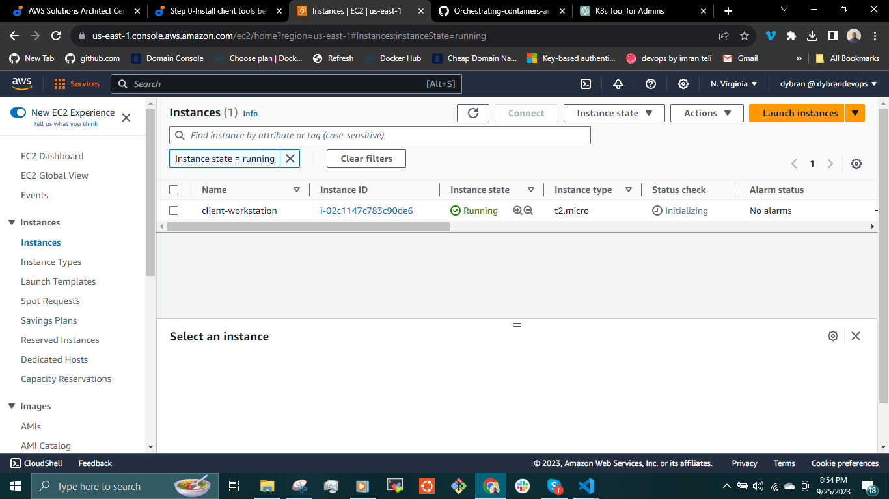
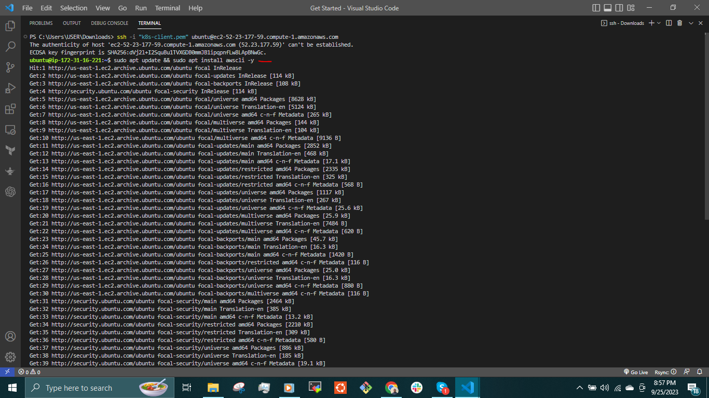
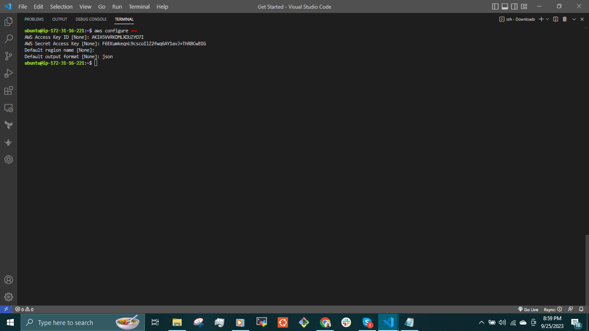

To verify run any __aws cli__ commands.

`$ aws ec2 describe-vpcs`

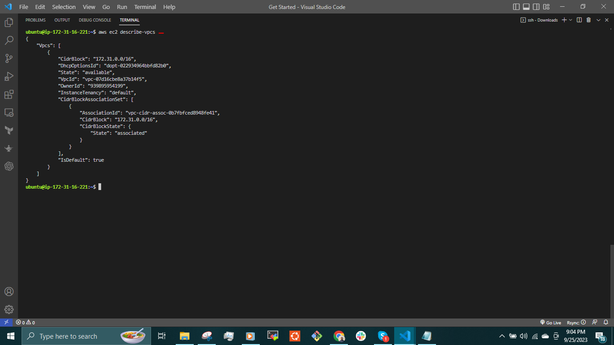

and check if you can see VPC details.

__Install kubectl__

A Kubernetes cluster features a Web API capable of handling __HTTP/HTTPS__ requests. However, continually using curl to send commands can be cumbersome. To streamline the tasks of a Kubernetes administrator, the __kubectl__ command tool was created.

This versatile tool simplifies interactions with Kubernetes, enabling administrators to effortlessly deploy applications, inspect and manage cluster resources, access logs and execute various administrative tasks.

To setup kubectl we will refer to the [kubernetes documentation](https://kubernetes.io/docs/tasks/tools/install-kubectl-linux/#install-kubectl-binary-with-curl-on-linux).

Download the binary

`$ wget https://storage.googleapis.com/kubernetes-release/release/v1.21.0/bin/linux/amd64/kubectl`

Make it executable

`$ chmod +x kubectl`

Move to the Bin directory

`$ sudo mv kubectl /usr/local/bin/`

Verify that kubectl version 1.21.0 or higher is installed:

`$ kubectl version --client`

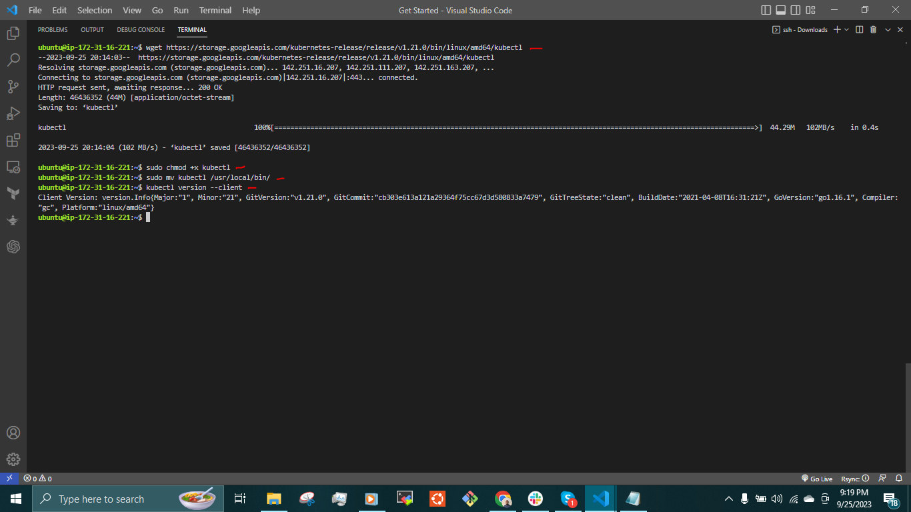

__Install CFSSL and CFSSLJSON__

__cfssl__ is an open source tool by __Cloudflare__ used to setup a [__Public Key Infrastructure__](https://en.wikipedia.org/wiki/Public_key_infrastructure). for generating, signing and bundling TLS certificates. In previous projects you have experienced the use of Letsencrypt for the similar use case. Here, cfssl will be configured as a Certificate Authority which will issue the certificates required to spin up a Kubernetes cluster.

Download, install and verify successful installation of cfssl and cfssljson:

`$ wget -q --show-progress --https-only --timestamping https://github.com/cloudflare/cfssl/releases/download/v1.6.3/cfssl_1.6.3_linux_amd64 https://github.com/cloudflare/cfssl/releases/download/v1.6.3/cfssljson_1.6.3_linux_amd64`

`$ chmod +x cfssl_1.6.3_linux_amd64 cfssljson_1.6.3_linux_amd64`

`$ sudo mv cfssl_1.6.3_linux_amd64 /usr/local/bin/cfssl`

`$ sudo mv cfssljson_1.6.3_linux_amd64 /usr/local/bin/cfssljson`

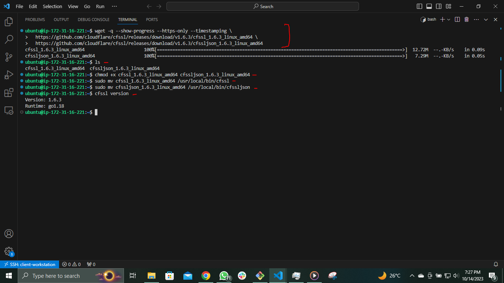

__AWS CLOUD RESOURCES FOR KUBERNETES CLUSTER__

__Configure Network Infrastructure - Virtual Private Cloud (VPC)__

Create a directory named __manual-k8s-cluster__

Create a VPC and store the ID as a variable:

`$ VPC_ID=$(aws ec2 create-vpc --cidr-block 172.31.0.0/16 --output text --query 'Vpc.VpcId')`

Tag the VPC so that it is named

`$ aws ec2 create-tags --resources ${VPC_ID} --tags Key=Name,Value=manual-k8s-cluster`


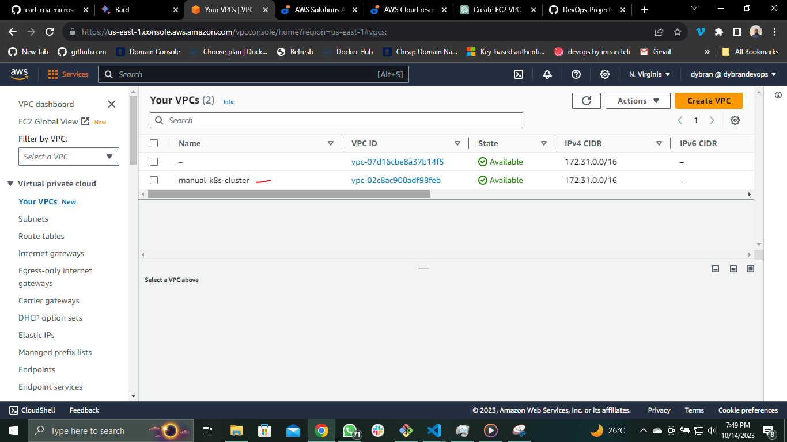

__Domain Name System – DNS__

Enable DNS support for your VPC

`$ aws ec2 modify-vpc-attribute --vpc-id ${VPC_ID} --enable-dns-support '{"Value": true}'`

Enable DNS support for hostnames

`$ aws ec2 modify-vpc-attribute --vpc-id ${VPC_ID} --enable-dns-hostnames '{"Value": true}'`

AWS Region

Set the required region

`$ AWS_REGION=us-east-1`

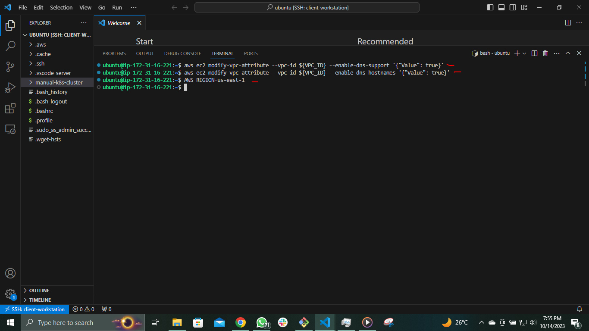

__Dynamic Host Configuration Protocol – DHCP__

__Configure DHCP Options Set__

__The Dynamic Host Configuration Protocol (DHCP)__ is a network management protocol employed in Internet Protocol networks. Its primary function is to autonomously allocate IP addresses and establish various communication parameters for devices linked to the network through a client-server architecture.

__AWS__ upon the initiation of __VPC__, automatically generates and associates a __DHCP__ option set. This option set contains two predefined settings: __domain-name-servers__, which defaults to __AmazonProvidedDNS__, and __domain-name__, which defaults to the domain name associated with your specified region. __AmazonProvidedDNS__ denotes an Amazon Domain Name System (DNS) server, facilitating DNS-based communication for instances.

By default, Amazon Elastic Compute Cloud (EC2) instances are assigned fully qualified domain names, such as `ip-172-50-197-106.eu-central-1.compute.internal`. However, you can configure your own custom settings, as demonstrated in the example below.

`$ DHCP_OPTION_SET_ID=$(aws ec2 create-dhcp-options --dhcp-configuration "Key=domain-name,Values=$AWS_REGION.compute.internal" "Key=domain-name-servers,Values=AmazonProvidedDNS" --output text --query 'DhcpOptions.DhcpOptionsId')`

Tag the DHCP Option set

`$ aws ec2 create-tags --resources ${DHCP_OPTION_SET_ID} --tags Key=Name,Value=manual-k8s-cluster`

Associate the DHCP Option set with the VPC

`$ aws ec2 associate-dhcp-options --dhcp-options-id ${DHCP_OPTION_SET_ID} --vpc-id ${VPC_ID}`

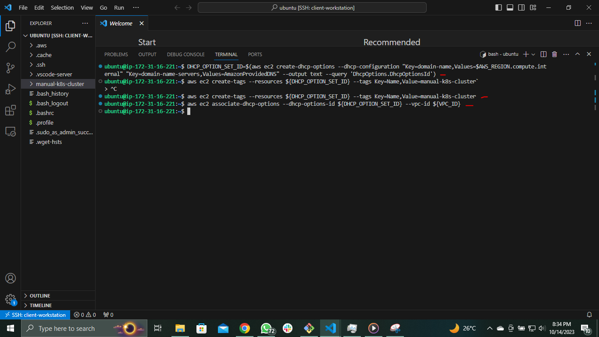

__Subnet__

Create and tag the Subnet

`$ SUBNET_ID=$(aws ec2 create-subnet --vpc-id ${VPC_ID} --cidr-block 172.31.0.0/24 --output text --query 'Subnet.SubnetId')`

`$ aws ec2 create-tags --resources ${SUBNET_ID} --tags Key=Name,Value=manual-k8s-cluster`

__Internet Gateway – IGW__

Create the Internet Gateway and attach it to the VPC

`$ INTERNET_GATEWAY_ID=$(aws ec2 create-internet-gateway --output text --query 'InternetGateway.InternetGatewayId')`

`$ aws ec2 create-tags --resources ${INTERNET_GATEWAY_ID} --tags Key=Name,Value=manual-k8s-cluster`

Attah to VPC

`$ aws ec2 attach-internet-gateway --internet-gateway-id ${INTERNET_GATEWAY_ID} --vpc-id ${VPC_ID}`

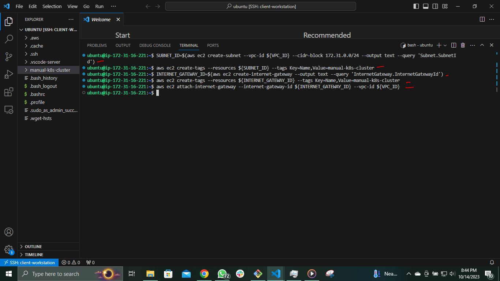

__Route tables__

Create route tables, associate the route table to subnet, and create a route to allow external traffic to the Internet through the Internet Gateway

`$ ROUTE_TABLE_ID=$(aws ec2 create-route-table --vpc-id ${VPC_ID} --output text --query 'RouteTable.RouteTableId')`

`$ aws ec2 create-tags --resources ${ROUTE_TABLE_ID} --tags Key=Name,Value=manual-k8s-cluster`

`$ aws ec2 associate-route-table --route-table-id ${ROUTE_TABLE_ID} --subnet-id ${SUBNET_ID}`

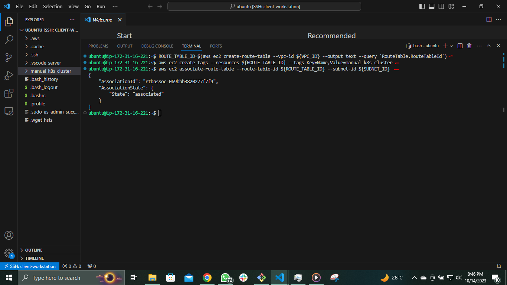

Create a route to allow external traffic to the Internet through the Internet Gateway

`$ aws ec2 create-route --route-table-id ${ROUTE_TABLE_ID} --destination-cidr-block 0.0.0.0/0 --gateway-id ${INTERNET_GATEWAY_ID}`

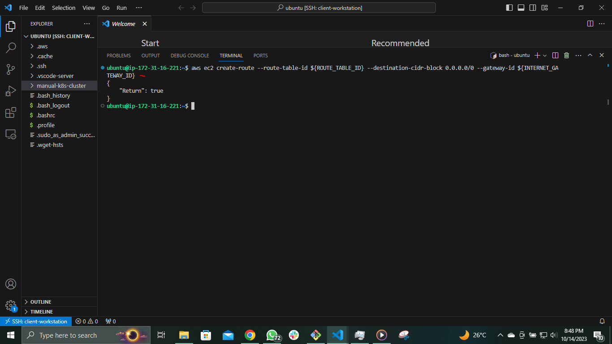

__Security Groups__

Configure security groups

Create the security group and store its ID in a variable

`$ SECURITY_GROUP_ID=$(aws ec2 create-security-group --group-name manual-k8s-cluster --description "Kubernetes cluster security group" --vpc-id ${VPC_ID} --output text --query 'GroupId')`

Create the NAME tag for the security group

`$ aws ec2 create-tags --resources ${SECURITY_GROUP_ID} --tags Key=Name,Value=manual-k8s-cluster`

Create Inbound traffic for all communication within the subnet to connect on ports used by the master node(s)

`$ aws ec2 authorize-security-group-ingress --group-id ${SECURITY_GROUP_ID} --ip-permissions IpProtocol=tcp,FromPort=2379,ToPort=2380,IpRanges='[{CidrIp=172.31.0.0/24}]'`

Create Inbound traffic for all communication within the subnet to connect on ports used by the worker nodes

`$ aws ec2 authorize-security-group-ingress --group-id ${SECURITY_GROUP_ID} --ip-permissions IpProtocol=tcp,FromPort=30000,ToPort=32767,IpRanges='[{CidrIp=172.31.0.0/24}]'`

Create inbound traffic to allow connections to the Kubernetes API Server (port 6443) listening on port 6443

`$ aws ec2 authorize-security-group-ingress --group-id ${SECURITY_GROUP_ID} --protocol tcp --port 6443 --cidr 0.0.0.0/0`

Create inbound SSH traffic from any source. In a production environment, restrict access exclusively to desired IPs or CIDR ranges for connection.

`$ aws ec2 authorize-security-group-ingress --group-id ${SECURITY_GROUP_ID} --protocol tcp --port 22 --cidr 0.0.0.0/0`

Create ICMP ingress for all types

`$ aws ec2 authorize-security-group-ingress --group-id ${SECURITY_GROUP_ID} --protocol icmp --port -1 --cidr 0.0.0.0/0`

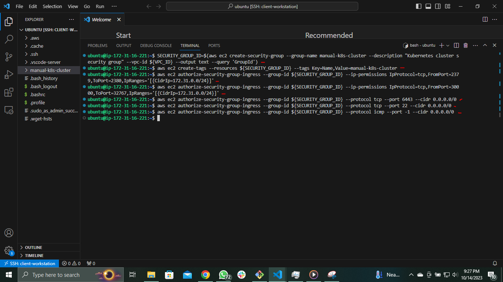

__Network Load Balancer__

Create a network Load balancer

`$ LOAD_BALANCER_ARN=$(aws elbv2 create-load-balancer --name manual-k8s-cluster --subnets ${SUBNET_ID} --scheme internet-facing --type network --output text --query 'LoadBalancers[].LoadBalancerArn')`

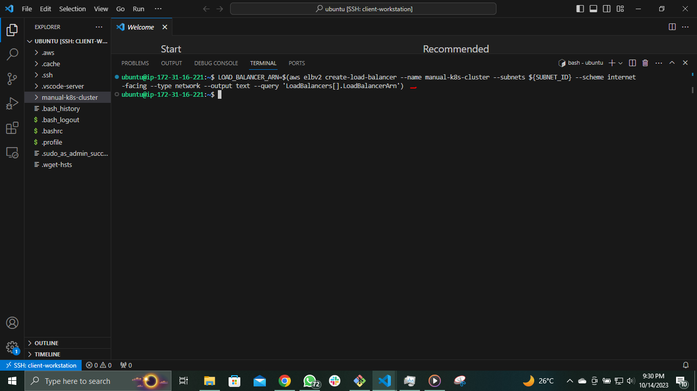

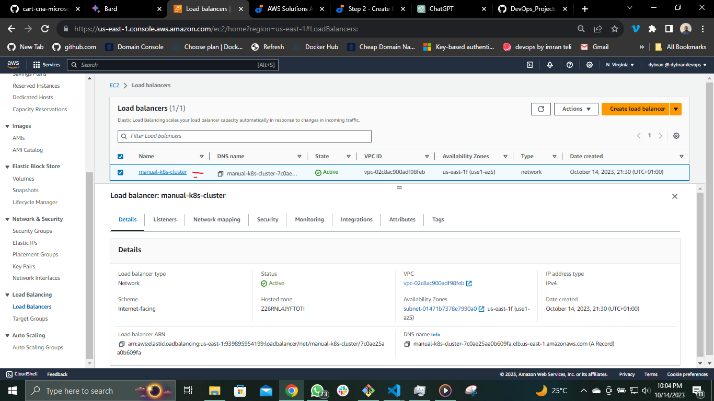

__Tagret Group__

Create a target group acknowledging its lack of defined criteria at this stage due to the absence of real targets. it will be __"unhealthy"__.

`$ TARGET_GROUP_ARN=$(aws elbv2 create-target-group --name manual-k8s-cluster --protocol TCP --port 6443 --vpc-id ${VPC_ID} --target-type ip --output text --query 'TargetGroups[].TargetGroupArn')`

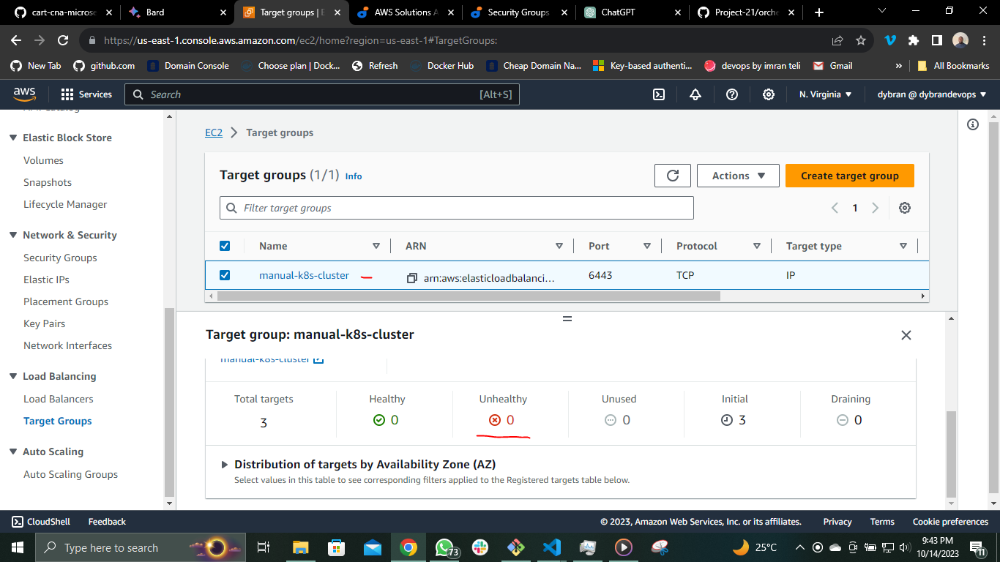

Register targets: Similar to above, you will provide the IP addresses for registration purposes. These IP addresses will serve as targets when the nodes become available.

`$ aws elbv2 register-targets --target-group-arn ${TARGET_GROUP_ARN} --targets Id=172.31.0.1{0,1,2}`

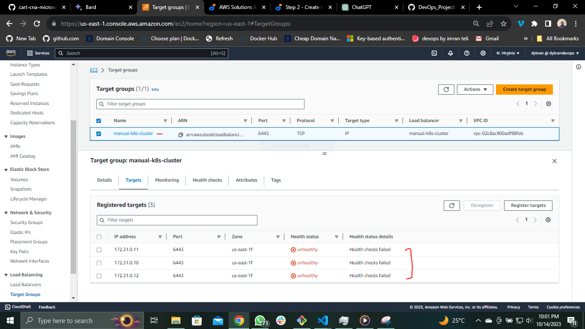

Create a listener to listen for requests and forward to the target nodes on TCP port 6443

`$ aws elbv2 create-listener --load-balancer-arn ${LOAD_BALANCER_ARN} --protocol TCP --port 6443 --default-actions Type=forward,TargetGroupArn=${TARGET_GROUP_ARN} --output text --query 'Listeners[].ListenerArn'`

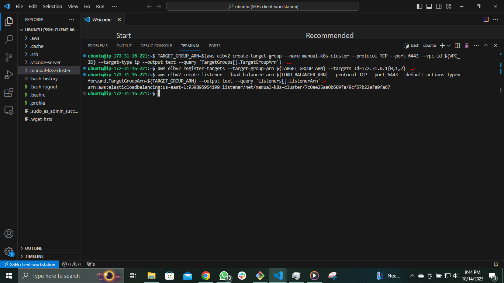

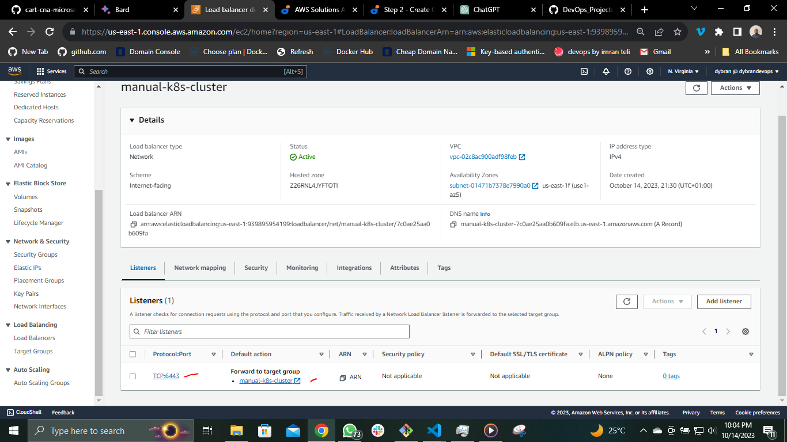


__K8s Public Address__

Get the Kubernetes Public address

`$ KUBERNETES_PUBLIC_ADDRESS=$(aws elbv2 describe-load-balancers --load-balancer-arns ${LOAD_BALANCER_ARN} --output text --query 'LoadBalancers[].DNSName')`

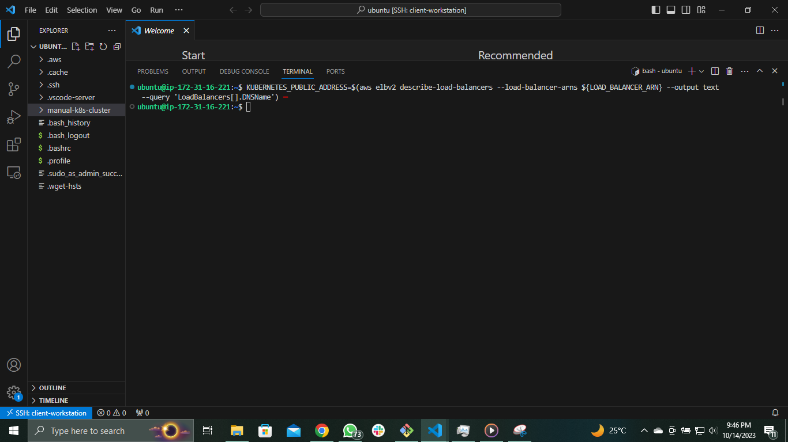

__CREATE COMPUTE RESOURCES__

Install __jq tool__

__jq__ is a lightweight and flexible command-line tool for processing and manipulating JSON data. It is commonly used in Unix-like operating systems to filter, transform, and format JSON data from various sources, including files, APIs, and other data streams. jq provides a wide range of features for querying and manipulating JSON, making it a powerful tool for tasks like parsing JSON, extracting specific data, and creating new JSON structures.

`$ sudo apt update && sudo apt install jq -y`

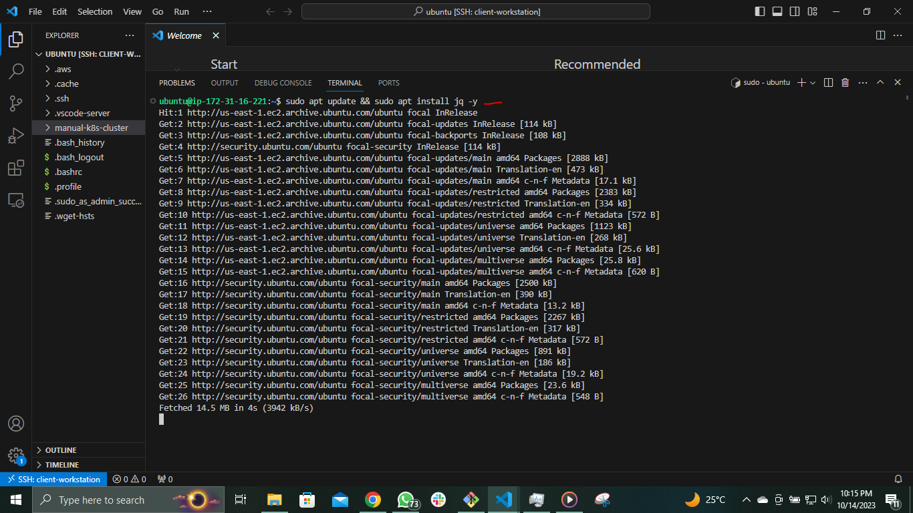

__AMI__

Get an image to create EC2 instances

`$ IMAGE_ID=$(aws ec2 describe-images --owners 099720109477 --filters 'Name=root-device-type,Values=ebs' 'Name=architecture,Values=x86_64' 'Name=name,Values=ubuntu/images/hvm-ssd/ubuntu-focal-20.04-amd64-server-*' | jq -r '.Images|sort_by(.Name)[-1]|.ImageId')`

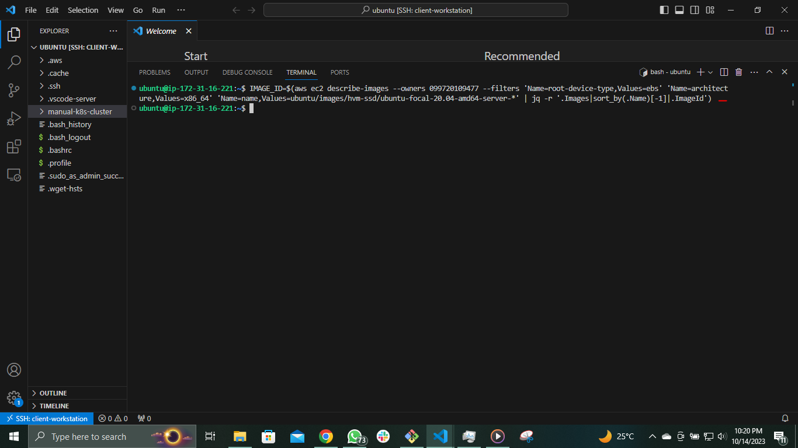

__SSH key-pair__

Create SSH Key-Pair

`$ mkdir -p ssh`

`$ aws ec2 create-key-pair --key-name manual-k8s-cluster --output text --query 'KeyMaterial' > ssh/manual-k8s-cluster.id_rsa`

`$ chmod 600 ssh/manual-k8s-cluster.id_rsa`

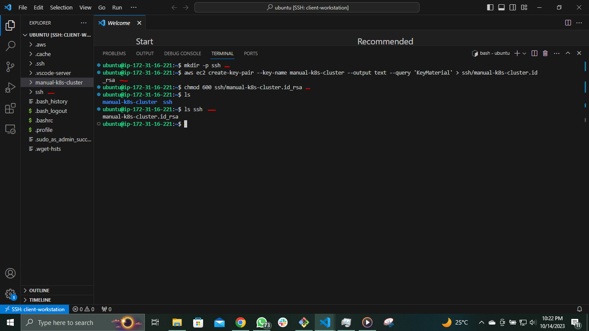

__EC2 Instances for Controle Plane (Master Nodes)__

Create 3 Master nodes

```
for i in 0 1 2; do
  instance_id=$(aws ec2 run-instances \
    --associate-public-ip-address \
    --image-id ${IMAGE_ID} \
    --count 1 \
    --key-name manual-k8s-cluster \
    --security-group-ids ${SECURITY_GROUP_ID} \
    --instance-type t2.micro \
    --private-ip-address 172.31.0.1${i} \
    --user-data "name=master-${i}" \
    --subnet-id ${SUBNET_ID} \
    --output text --query 'Instances[].InstanceId')
  aws ec2 modify-instance-attribute \
    --instance-id ${instance_id} \
    --no-source-dest-check
  aws ec2 create-tags \
    --resources ${instance_id} \
    --tags "Key=Name,Value=manual-k8s-cluster-master-${i}"
done
```

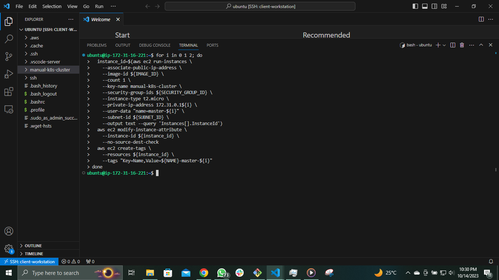

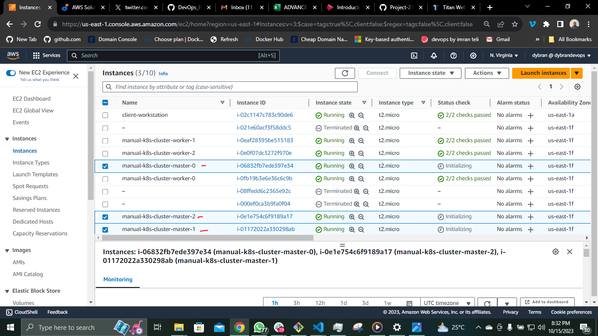

__EC2 Instances for Worker Nodes__

Create 3 worker nodes

```
for i in 0 1 2; do
  instance_id=$(aws ec2 run-instances \
    --associate-public-ip-address \
    --image-id ${IMAGE_ID} \
    --count 1 \
    --key-name manual-k8s-cluster \
    --security-group-ids ${SECURITY_GROUP_ID} \
    --instance-type t2.micro \
    --private-ip-address 172.31.0.2${i} \
    --user-data "name=worker-${i}|pod-cidr=172.20.${i}.0/24" \
    --subnet-id ${SUBNET_ID} \
    --output text --query 'Instances[].InstanceId')
  aws ec2 modify-instance-attribute \
    --instance-id ${instance_id} \
    --no-source-dest-check
  aws ec2 create-tags \
    --resources ${instance_id} \
    --tags "Key=Name,Value=manual-k8s-cluster-worker-${i}"
done
```


__PREPARE THE SELF-SIGNED CERTIFICATE AUTHORITY AND GENERATE TLS CERTIFICATES__

The following components running on the Master node will require TLS certificates.

- kube-controller-manager
- kube-scheduler
- etcd
- kube-apiserver

The following components running on the Worker nodes will require TLS certificates.

- kubelet
- kube-proxy

Therefore, you will provision a __PKI Infrastructure__ using __cfssl__ which will have a Certificate Authority. The CA will then generate certificates for all the individual components.

__Self-Signed Root Certificate Authority (CA)__

Here, We will provision a CA that will be used to sign additional TLS certificates.

Create a directory and cd into it

`$ mkdir ca-authority && cd ca-authority`

```
{

cat > ca-config.json <<EOF
{
  "signing": {
    "default": {
      "expiry": "8760h"
    },
    "profiles": {
      "kubernetes": {
        "usages": ["signing", "key encipherment", "server auth", "client auth"],
        "expiry": "8760h"
      }
    }
  }
}
EOF

cat > ca-csr.json <<EOF
{
  "CN": "Kubernetes",
  "key": {
    "algo": "rsa",
    "size": 2048
  },
  "names": [
    {
      "C": "UK",
      "L": "England",
      "O": "Kubernetes",
      "OU": "Dybran-projects",
      "ST": "London"
    }
  ]
}
EOF

cfssl gencert -initca ca-csr.json | cfssljson -bare ca

}
```

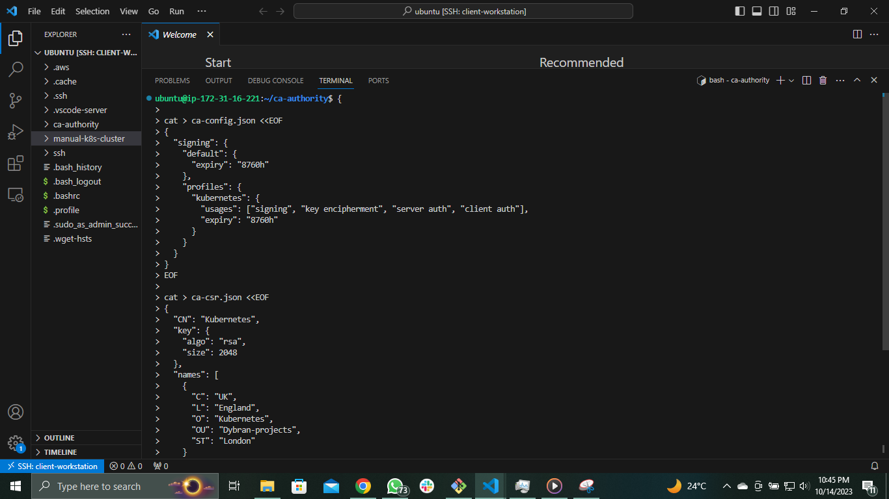
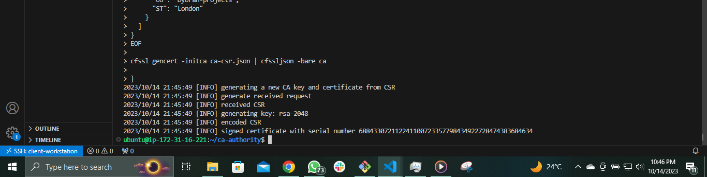


The 3 important files here are:

- __ca.pem__ – The Root Certificate
- __ca-key.pem__ – The Private Key
- __ca.csr__ – The Certificate Signing Request

__Generating TLS Certificates For Client and Server__

We will need to provision Client/Server certificates for all the components. We must have encrypted communication within the cluster. Therefore, the server here are the master nodes running the api-server component. While the client is every other component that needs to communicate with the api-server.

Now we have a certificate for the Root __CA__, we can then begin to request more certificates which the different Kubernetes components, i.e. clients and server, will use to have encrypted communication.

Remember, the clients here refer to every other component that will communicate with the api-server. These are:

- kube-controller-manager
- kube-scheduler
- etcd
- kubelet
- kube-proxy
- Kubernetes Admin User

Let us begin with the Kubernetes API-Server Certificate and Private Key

The certificate for the Api-server must have __IP addresses, DNS names__, and a __Load Balancer address__ included. Otherwise, we will have a lot of difficulties connecting to the api-server.

Generate the Certificate Signing Request (CSR), Private Key and the Certificate for the Kubernetes Master Nodes.
```
{
cat > master-kubernetes-csr.json <<EOF
{
  "CN": "kubernetes",
   "hosts": [
   "127.0.0.1",
   "172.31.0.10",
   "172.31.0.11",
   "172.31.0.12",
   "ip-172-31-0-10",
   "ip-172-31-0-11",
   "ip-172-31-0-12",
   "ip-172-31-0-10.${AWS_REGION}.compute.internal",
   "ip-172-31-0-11.${AWS_REGION}.compute.internal",
   "ip-172-31-0-12.${AWS_REGION}.compute.internal",
   "${KUBERNETES_PUBLIC_ADDRESS}",
   "kubernetes",
   "kubernetes.default",
   "kubernetes.default.svc",
   "kubernetes.default.svc.cluster",
   "kubernetes.default.svc.cluster.local"
  ],
  "key": {
    "algo": "rsa",
    "size": 2048
  },
  "names": [
    {
      "C": "UK",
      "L": "England",
      "O": "Kubernetes",
      "OU": "Dybran-projects",
      "ST": "London"
    }
  ]
}
EOF

cfssl gencert \
  -ca=ca.pem \
  -ca-key=ca-key.pem \
  -config=ca-config.json \
  -profile=kubernetes \
  master-kubernetes-csr.json | cfssljson -bare master-kubernetes
}
```
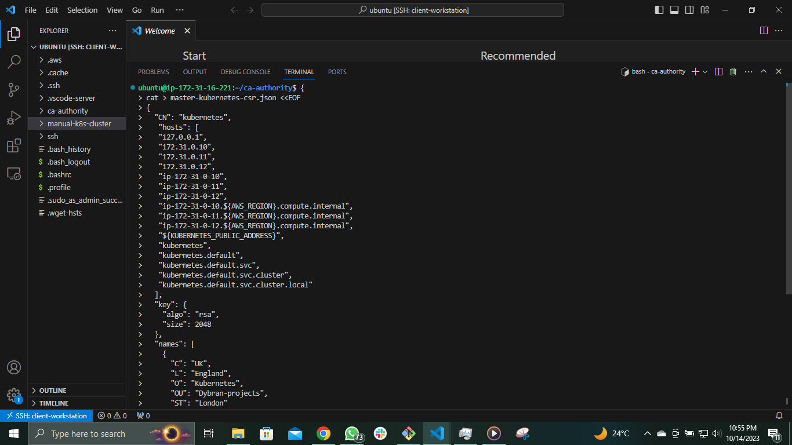
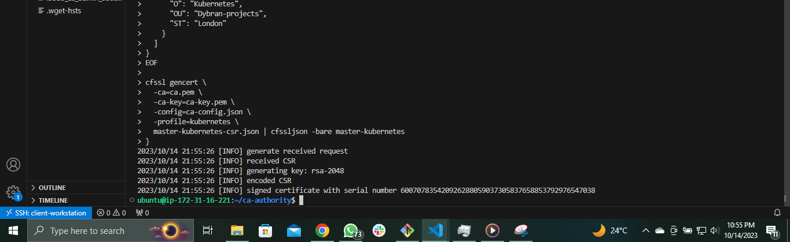

Creating the other certificates: for the following Kubernetes components:

- Scheduler Client Certificate
- Kube Proxy Client Certificate
- Controller Manager Client Certificate
- Kubelet Client Certificates
- K8s admin user Client Certificate

__kube-scheduler Client - Certificate and Private Key__

```
{

cat > kube-scheduler-csr.json <<EOF
{
  "CN": "system:kube-scheduler",
  "key": {
    "algo": "rsa",
    "size": 2048
  },
  "names": [
    {
      "C": "UK",
      "L": "England",
      "O": "system:kube-scheduler",
      "OU": "Dybran-projects",
      "ST": "London"
    }
  ]
}
EOF

cfssl gencert \
  -ca=ca.pem \
  -ca-key=ca-key.pem \
  -config=ca-config.json \
  -profile=kubernetes \
  kube-scheduler-csr.json | cfssljson -bare kube-scheduler

}
```

__kube-proxy Client - Certificate and Private Key__

```
{

cat > kube-proxy-csr.json <<EOF
{
  "CN": "system:kube-proxy",
  "key": {
    "algo": "rsa",
    "size": 2048
  },
  "names": [
    {
      "C": "UK",
      "L": "England",
      "O": "system:node-proxier",
      "OU": "Dybran-projects",
      "ST": "London"
    }
  ]
}
EOF

cfssl gencert \
  -ca=ca.pem \
  -ca-key=ca-key.pem \
  -config=ca-config.json \
  -profile=kubernetes \
  kube-proxy-csr.json | cfssljson -bare kube-proxy

}
```
__kube-controller-manager - Client Certificate and Private Key__

```
{
cat > kube-controller-manager-csr.json <<EOF
{
  "CN": "system:kube-controller-manager",
  "key": {
    "algo": "rsa",
    "size": 2048
  },
  "names": [
    {
      "C": "UK",
      "L": "England",
      "O": "system:kube-controller-manager",
      "OU": "Dybran-projects",
      "ST": "London"
    }
  ]
}
EOF

cfssl gencert \
  -ca=ca.pem \
  -ca-key=ca-key.pem \
  -config=ca-config.json \
  -profile=kubernetes \
  kube-controller-manager-csr.json | cfssljson -bare kube-controller-manager

}
```
__kubelet Client - Certificate and Private Key__

Similar to how we configured the api-server's certificate, Kubernetes requires that the hostname of each worker node is included in the client certificate.

Also, Kubernetes uses a special-purpose authorization mode called Node Authorizer, that specifically authorizes API requests made by kubelet services. In order to be authorized by the Node Authorizer, kubelets must use a credential that identifies them as being in the system:nodes group, with a username of system:node:<nodeName>. Notice the "CN": "system:node:${instance_hostname}", in the below code.

Therefore, the certificate to be created must comply to these requirements. In the below example, there are 3 worker nodes, hence we will use bash to loop through a list of the worker nodes’ hostnames, and based on each index, the respective Certificate Signing Request (CSR), private key and client certificates will be generated.

```
for i in 0 1 2; do
  instance="manual-k8s-cluster-worker-${i}"
  instance_hostname="ip-172-31-0-2${i}"
  cat > ${instance}-csr.json <<EOF
{
  "CN": "system:node:${instance_hostname}",
  "key": {
    "algo": "rsa",
    "size": 2048
  },
  "names": [
    {
      "C": "UK",
      "L": "England",
      "O": "system:nodes",
      "OU": "Dybran-projects",
      "ST": "London"
    }
  ]
}
EOF

  external_ip=$(aws ec2 describe-instances \
    --filters "Name=tag:Name,Values=${instance}" \
    --output text --query 'Reservations[].Instances[].PublicIpAddress')

  internal_ip=$(aws ec2 describe-instances \
    --filters "Name=tag:Name,Values=${instance}" \
    --output text --query 'Reservations[].Instances[].PrivateIpAddress')

  cfssl gencert \
    -ca=ca.pem \
    -ca-key=ca-key.pem \
    -config=ca-config.json \
    -hostname=${instance_hostname},${external_ip},${internal_ip} \
    -profile=kubernetes \
    manual-k8s-cluster-worker-${i}-csr.json | cfssljson -bare manual-k8s-cluster-worker-${i}
done
```

__kubernetes admin user - Client Certificate and Private Key__

```
{
cat > admin-csr.json <<EOF
{
  "CN": "admin",
  "key": {
    "algo": "rsa",
    "size": 2048
  },
  "names": [
    {
      "C": "UK",
      "L": "England",
      "O": "system:masters",
      "OU": "Dybran-projects",
      "ST": "London"
    }
  ]
}
EOF

cfssl gencert \
  -ca=ca.pem \
  -ca-key=ca-key.pem \
  -config=ca-config.json \
  -profile=kubernetes \
  admin-csr.json | cfssljson -bare admin
}
```
__Token Controller - certificate and private key__

We need to generate certificate and private key for the __Token Controller__ - a part of the Kubernetes Controller Manager.

kube-controller-manager responsible for generating and signing service account tokens which are used by pods or other resources to establish connectivity to the api-server.

```
{

cat > service-account-csr.json <<EOF
{
  "CN": "service-accounts",
  "key": {
    "algo": "rsa",
    "size": 2048
  },
  "names": [
    {
      "C": "UK",
      "L": "England",
      "O": "Kubernetes",
      "OU": "Dybran-projects",
      "ST": "London"
    }
  ]
}
EOF

cfssl gencert \
  -ca=ca.pem \
  -ca-key=ca-key.pem \
  -config=ca-config.json \
  -profile=kubernetes \
  service-account-csr.json | cfssljson -bare service-account
}
```
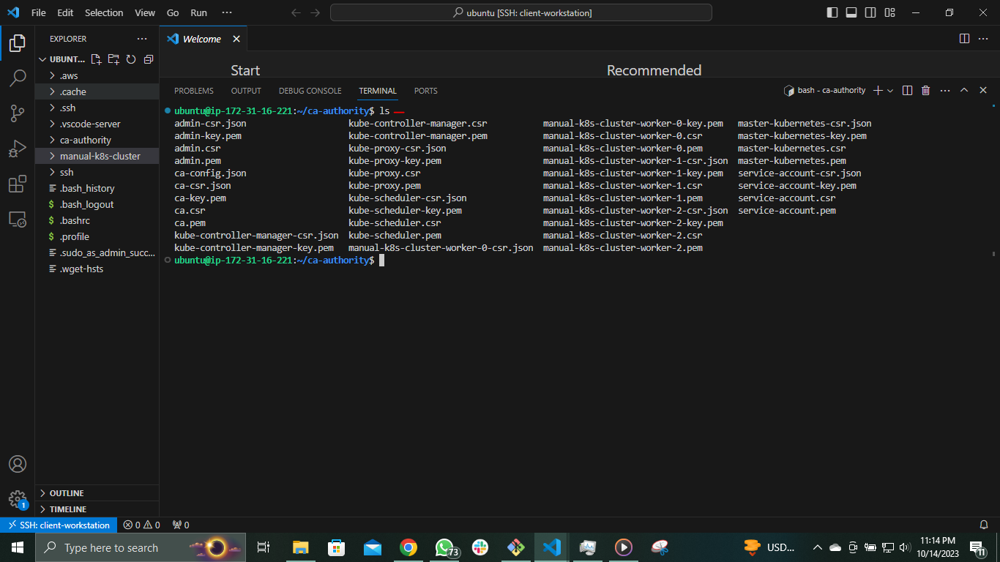

__DISTRIBUTING THE CLIENT AND SERVER CERTIFICATES__

Now it is time to start sending all the client and server certificates to their respective instances.

Let us begin with the worker nodes:

Copy these files securely to the worker nodes using scp utility

- Root CA certificate – ca.pem
- X509 Certificate for each worker node
- Private Key of the certificate for each worker node

```
for i in 0 1 2; do
  instance="manual-k8s-cluster-worker-${i}"
  external_ip=$(aws ec2 describe-instances \
    --filters "Name=tag:Name,Values=${instance}" \
    --output text --query 'Reservations[].Instances[].PublicIpAddress')
  scp -i ../ssh/manual-k8s-cluster.id_rsa \
    ca.pem ${instance}-key.pem ${instance}.pem ubuntu@${external_ip}:~/; \
done
```
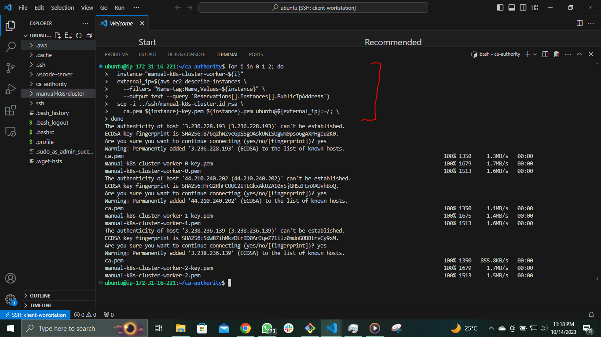

__Master or Controller node: – Note that only the api-server related files will be sent over to the master nodes.__

```
for i in 0 1 2; do
instance="manual-k8s-cluster-master-${i}" \
  external_ip=$(aws ec2 describe-instances \
    --filters "Name=tag:Name,Values=${instance}" \
    --output text --query 'Reservations[].Instances[].PublicIpAddress')
  scp -i ../ssh/manual-k8s-cluster.id_rsa \
    ca.pem ca-key.pem service-account-key.pem service-account.pem \
    master-kubernetes.pem master-kubernetes-key.pem ubuntu@${external_ip}:~/;
done
```

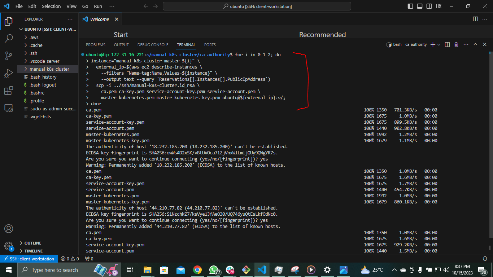

The kube-proxy, kube-controller-manager, kube-scheduler and kubelet client certificates will be used to generate client authentication configuration files later on.

__GENERATE KUBERNETES CONFIGURATION FILES FOR AUTHENTICATION USING 'KUBECTL'__

 In this step, We will create some files known as kubeconfig, which enables Kubernetes clients to locate and authenticate to the Kubernetes API Servers.

You will need a client tool called kubectl to do this. And, by the way, most of your time with Kubernetes will be spent using kubectl commands.

Now it’s time to generate kubeconfig files for the kubelet, controller manager, kube-proxy, and scheduler clients and then the admin user.

First, let us create a few environment variables for reuse by multiple commands.

`$ KUBERNETES_API_SERVER_ADDRESS=$(aws elbv2 describe-load-balancers --load-balancer-arns ${LOAD_BALANCER_ARN} --output text --query 'LoadBalancers[].DNSName')`

__Generate the kubelet kubeconfig file__

For each of the nodes running the kubelet component, it is very important that the client certificate configured for that node is used to generate the kubeconfig. This is because each certificate has the node’s DNS name or IP Address configured at the time the certificate was generated. It will also ensure that the appropriate authorization is applied to that node through the Node Authorizer

Run the code below in the directory where all the certificates were generated.

```
for i in 0 1 2; do

instance="manual-k8s-cluster-worker-${i}"
instance_hostname="ip-172-31-0-2${i}"

 # Set the kubernetes cluster in the kubeconfig file
  kubectl config set-cluster manual-k8s-cluster \
    --certificate-authority=ca.pem \
    --embed-certs=true \
    --server=https://$KUBERNETES_API_SERVER_ADDRESS:6443 \
    --kubeconfig=${instance}.kubeconfig

# Set the cluster credentials in the kubeconfig file
  kubectl config set-credentials system:node:${instance_hostname} \
    --client-certificate=${instance}.pem \
    --client-key=${instance}-key.pem \
    --embed-certs=true \
    --kubeconfig=${instance}.kubeconfig

# Set the context in the kubeconfig file
  kubectl config set-context default \
    --cluster=manual-k8s-cluster \
    --user=system:node:${instance_hostname} \
    --kubeconfig=${instance}.kubeconfig

  kubectl config use-context default --kubeconfig=${instance}.kubeconfig
done
```
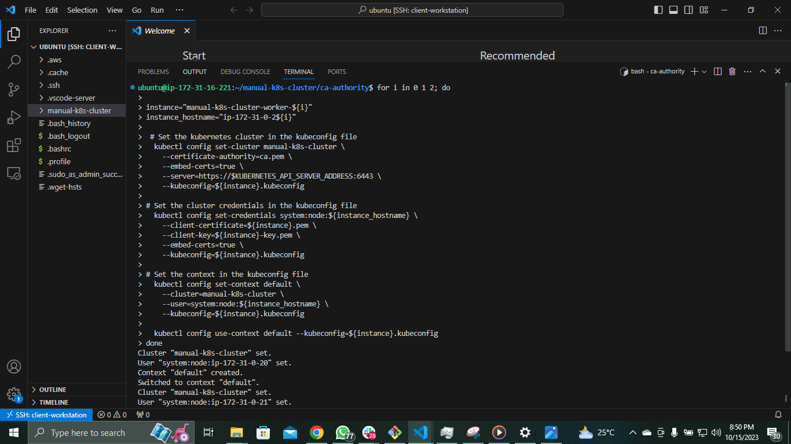
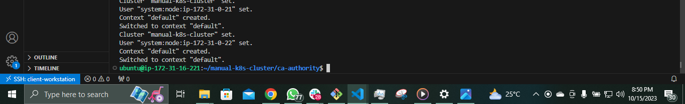

List the output

`$ ls -ltr *.kubeconfig`

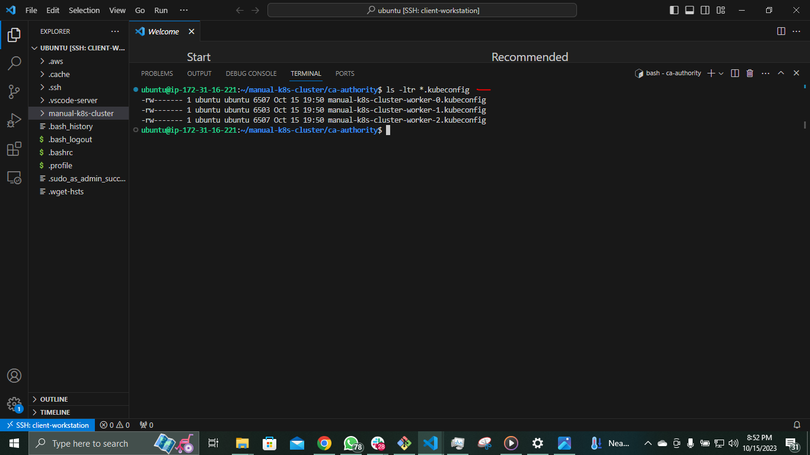

Open up the kubeconfig files generated and review the 3 different sections that have been configured:

- Cluster
- Credentials
- Kube Context

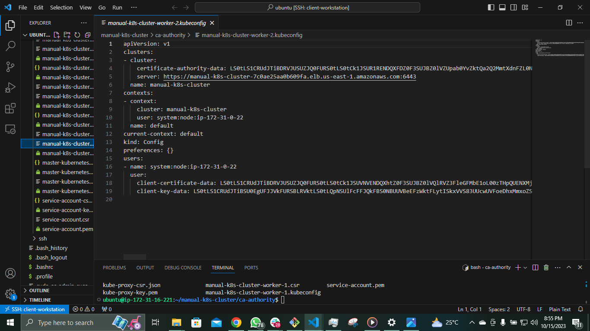

Kubeconfig file is used to organize information about clusters, users, namespaces and authentication mechanisms. By default, kubectl looks for a file named config in the __$HOME/.kube__ directory. You can specify other kubeconfig files by setting the KUBECONFIG environment variable or by setting the --kubeconfig flag.

Context part of kubeconfig file defines three main parameters: cluster, namespace and user. You can save several different contexts with any convenient names and switch between them when needed.

`$ kubectl config use-context %context-name%`

Generate the __kube-proxy kubeconfig__

```
{
  kubectl config set-cluster manual-k8s-cluster \
    --certificate-authority=ca.pem \
    --embed-certs=true \
    --server=https://${KUBERNETES_API_SERVER_ADDRESS}:6443 \
    --kubeconfig=kube-proxy.kubeconfig

  kubectl config set-credentials system:kube-proxy \
    --client-certificate=kube-proxy.pem \
    --client-key=kube-proxy-key.pem \
    --embed-certs=true \
    --kubeconfig=kube-proxy.kubeconfig

  kubectl config set-context default \
    --cluster=manual-k8s-cluster \
    --user=system:kube-proxy \
    --kubeconfig=kube-proxy.kubeconfig

  kubectl config use-context default --kubeconfig=kube-proxy.kubeconfig
}
```


Generate the __Kube-Controller-Manager kubeconfig__

Notice that the --server is set to use 127.0.0.1. This is because, this component runs on the API-Server so there is no point routing through the Load Balancer.

```
{
  kubectl config set-cluster manual-k8s-cluster \
    --certificate-authority=ca.pem \
    --embed-certs=true \
    --server=https://127.0.0.1:6443 \
    --kubeconfig=kube-controller-manager.kubeconfig

  kubectl config set-credentials system:kube-controller-manager \
    --client-certificate=kube-controller-manager.pem \
    --client-key=kube-controller-manager-key.pem \
    --embed-certs=true \
    --kubeconfig=kube-controller-manager.kubeconfig

  kubectl config set-context default \
    --cluster=manual-k8s-cluster \
    --user=system:kube-controller-manager \
    --kubeconfig=kube-controller-manager.kubeconfig

  kubectl config use-context default --kubeconfig=kube-controller-manager.kubeconfig
}
```
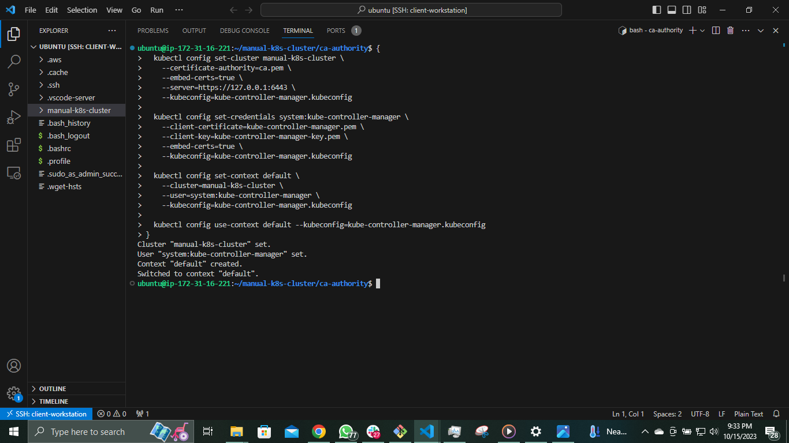

Generating the __Kube-Scheduler Kubeconfig__

```
{
  kubectl config set-cluster manual-k8s-cluster \
    --certificate-authority=ca.pem \
    --embed-certs=true \
    --server=https://127.0.0.1:6443 \
    --kubeconfig=kube-scheduler.kubeconfig

  kubectl config set-credentials system:kube-scheduler \
    --client-certificate=kube-scheduler.pem \
    --client-key=kube-scheduler-key.pem \
    --embed-certs=true \
    --kubeconfig=kube-scheduler.kubeconfig

  kubectl config set-context default \
    --cluster=manual-k8s-cluster \
    --user=system:kube-scheduler \
    --kubeconfig=kube-scheduler.kubeconfig

  kubectl config use-context default --kubeconfig=kube-scheduler.kubeconfig
}
```

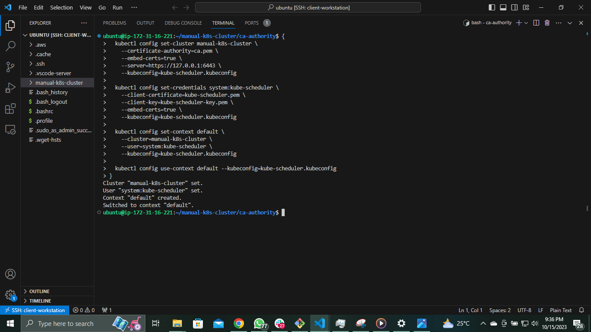

Generate the __kubeconfig file for the admin user__

```
{
  kubectl config set-cluster manual-k8s-cluster \
    --certificate-authority=ca.pem \
    --embed-certs=true \
    --server=https://${KUBERNETES_API_SERVER_ADDRESS}:6443 \
    --kubeconfig=admin.kubeconfig

  kubectl config set-credentials admin \
    --client-certificate=admin.pem \
    --client-key=admin-key.pem \
    --embed-certs=true \
    --kubeconfig=admin.kubeconfig

  kubectl config set-context default \
    --cluster=manual-k8s-cluster \
    --user=admin \
    --kubeconfig=admin.kubeconfig

  kubectl config use-context default --kubeconfig=admin.kubeconfig
}
```

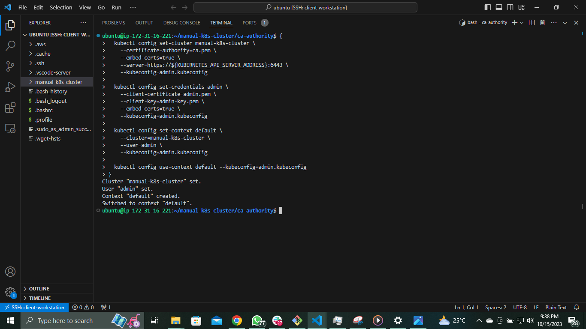

Distribute the files to their respective servers using scp and a for loop.


__For Worker nodes__

```
for i in 0 1 2; do
  instance="manual-k8s-cluster-worker-${i}"
  external_ip=$(aws ec2 describe-instances \
    --filters "Name=tag:Name,Values=${instance}" \
    --output text --query 'Reservations[].Instances[].PublicIpAddress')
  scp -i ../ssh/manual-k8s-cluster.id_rsa \
    kube-proxy.kubeconfig ${instance}-key.pem ${instance}.pem ubuntu@${external_ip}:~/; \
done
```
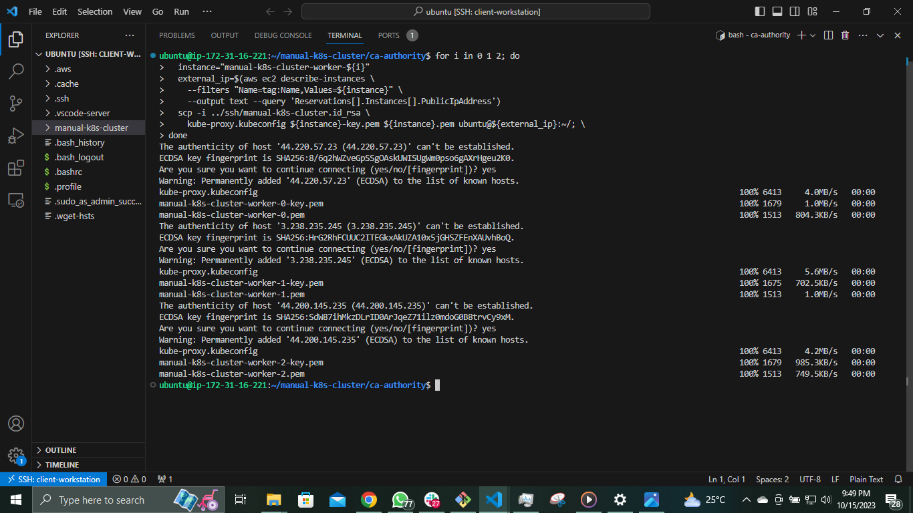


__For Master nodes__

```
for i in 0 1 2; do
instance="manual-k8s-cluster-master-${i}" \
  external_ip=$(aws ec2 describe-instances \
    --filters "Name=tag:Name,Values=${instance}" \
    --output text --query 'Reservations[].Instances[].PublicIpAddress')
  scp -i ../ssh/manual-k8s-cluster.id_rsa \
    ca.pem ca-key.pem service-account-key.pem service-account.pem \
    kube-controller-manager.kubeconfig kube-scheduler.kubeconfig admin.kubeconfig ubuntu@${external_ip}:~/;
done
```

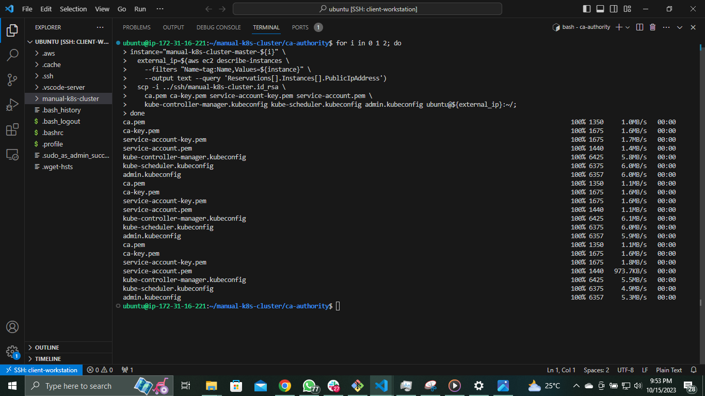

__PREPARE THE ETCD DATABASE FOR ENCRYPTION AT REST__

__Prepare the etcd database for encryption at rest.__

Kubernetes uses etcd (A distributed key value store) to store variety of data which includes the cluster state, application configurations, and secrets. By default, the data that is being persisted to the disk is not encrypted. Any attacker that is able to gain access to this database can exploit the cluster since the data is stored in plain text. Hence, it is a security risk for Kubernetes that needs to be addressed.

To mitigate this risk, we must prepare to encrypt etcd at rest. __"At rest"__ means data that is stored and persists on a disk. Anytime you hear __"in-flight"__ or __"in transit"__ refers to data that is being transferred over the network. __"In-flight"__ encryption is done through TLS.

__Generate the encryption key and encode it using "base64"__

Kubernetes uses a 32-byte (256-bit) encryption key for etcd encryption. Etcd is a distributed key-value store used by Kubernetes to store configuration data and other distributed system information securely. The 32-byte key is typically used for encryption in etcd to ensure the confidentiality and integrity of the stored data. This key is generated and managed as part of the Kubernetes cluster's configuration for security purposes.

`$ ETCD_ENCRYPTION_KEY=$(head -c 32 /dev/urandom | base64)`

See the output

`$ echo $ETCD_ENCRYPTION_KEY`

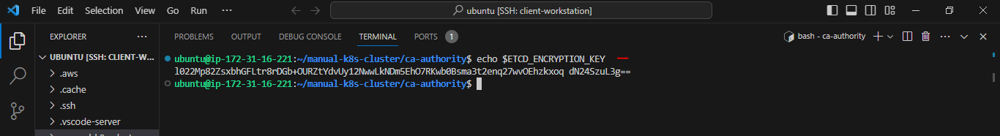

```
cat > encryption-config.yaml <<EOF
kind: EncryptionConfig
apiVersion: v1
resources:
  - resources:
      - secrets
    providers:
      - aescbc:
          keys:
            - name: key1
              secret: ${ETCD_ENCRYPTION_KEY}
      - identity: {}
EOF
```
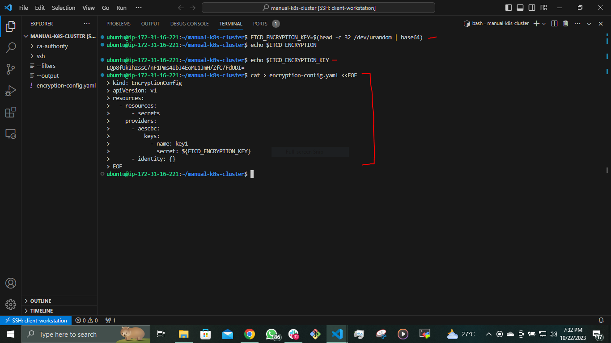

Send the encryption file to the Controller nodes using __scp__ and a __for__ loop

```
for i in 0 1 2; do
instance="manual-k8s-cluster-master-${i}" \
  external_ip=$(aws ec2 describe-instances \
    --filters "Name=tag:Name,Values=${instance}" \
    --output text --query 'Reservations[].Instances[].PublicIpAddress')
  scp -i ssh/manual-k8s-cluster.id_rsa \
    encryption-config.yaml ubuntu@${external_ip}:~/;
done
```
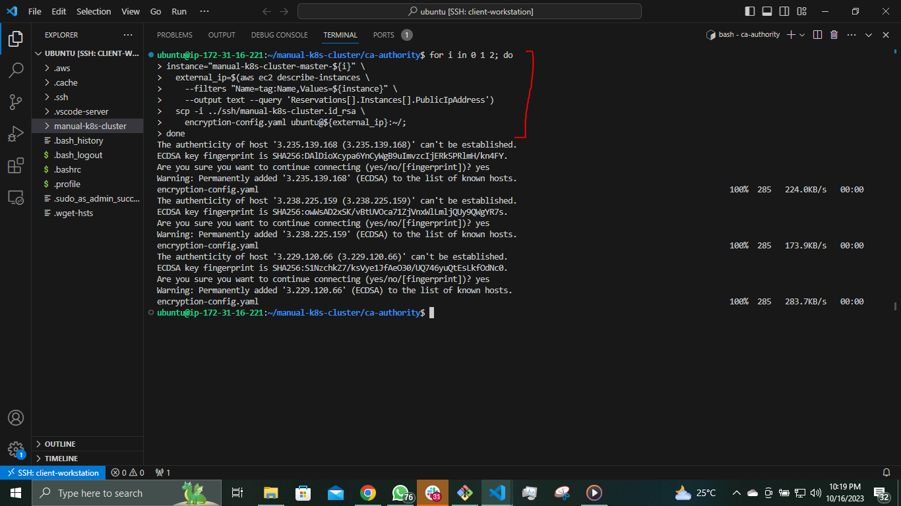

__Bootstrap "etcd" cluster__

The primary purpose of the etcd component is to store the state of the cluster. This is because Kubernetes itself is stateless. Therefore, all its stateful data will persist in etcd. Since Kubernetes is a distributed system – it needs a distributed storage to keep persistent data in it. etcd is a highly-available key value store that fits the purpose. All K8s cluster configurations are stored in a form of key value pairs in etcd, it also stores the actual and desired states of the cluster. etcd cluster is intelligent enough to watch for changes made on one instance and almost instantly replicate those changes to the rest of the instances, so all of them will be always reconciled.

__SSH into the controller server__

Open three terminals in __MobaXterm__, SSH into the __client-workstation__ and from each of these terminals, establish SSH connections to the different master nodes.
__Master 1__

```
master_1_ip=$(aws ec2 describe-instances \
--filters "Name=tag:Name,Values=manual-k8s-cluster-master-0" \
--output text --query 'Reservations[].Instances[].PublicIpAddress')
ssh -i ssh/manual-k8s-cluster.id_rsa ubuntu@${master_1_ip}
```

__Master 2__

```
master_2_ip=$(aws ec2 describe-instances \
--filters "Name=tag:Name,Values=manual-k8s-cluster-master-1" \
--output text --query 'Reservations[].Instances[].PublicIpAddress')
ssh -i ssh/manual-k8s-cluster.id_rsa ubuntu@${master_2_ip}
```

__Master 3__

```
master_3_ip=$(aws ec2 describe-instances \
--filters "Name=tag:Name,Values=manual-k8s-cluster-master-2" \
--output text --query 'Reservations[].Instances[].PublicIpAddress')
ssh -i ssh/manual-k8s-cluster.id_rsa ubuntu@${master_3_ip}
```

Run the command

`$ ls -ltr`

You should be able to see all the files that have been sent to the nodes


Download and install etcd on each of the terminals using the __multi-paste__ button.

`$ wget -q --show-progress --https-only --timestamping \
  "https://github.com/etcd-io/etcd/releases/download/v3.4.15/etcd-v3.4.15-linux-amd64.tar.gz"`

Extract and install the etcd server and the etcdctl command line utility

```
{
tar -xvf etcd-v3.4.15-linux-amd64.tar.gz
sudo mv etcd-v3.4.15-linux-amd64/etcd* /usr/local/bin/
}
```
Configure the etcd server

```
{
  sudo mkdir -p /etc/etcd /var/lib/etcd
  sudo chmod 700 /var/lib/etcd
  sudo cp ca.pem master-kubernetes-key.pem master-kubernetes.pem /etc/etcd/
}
```

The instance internal IP address will be used to serve client requests and communicate with etcd cluster peers. Retrieve the internal IP address for the current compute instance

`$ export INTERNAL_IP=$(curl -s http://169.254.169.254/latest/meta-data/local-ipv4)`

Each etcd member must have a unique name within an etcd cluster. Set the etcd name to node Private IP address so it will uniquely identify the machine

```
$ ETCD_NAME=$(curl -s http://169.254.169.254/latest/user-data/ \
  | tr "|" "\n" | grep "^name" | cut -d"=" -f2)

echo ${ETCD_NAME}
```

Create the __etcd.service systemd unit file__

Read the documentation [here](https://www.bookstack.cn/read/etcd-3.2.17-en/717bafd59fa87192.md).

```
cat <<EOF | sudo tee /etc/systemd/system/etcd.service
[Unit]
Description=etcd
Documentation=https://github.com/coreos

[Service]
Type=notify
ExecStart=/usr/local/bin/etcd \\
  --name ${ETCD_NAME} \\
  --trusted-ca-file=/etc/etcd/ca.pem \\
  --peer-trusted-ca-file=/etc/etcd/ca.pem \\
  --peer-client-cert-auth \\
  --client-cert-auth \\
  --listen-peer-urls https://${INTERNAL_IP}:2380 \\
  --listen-client-urls https://${INTERNAL_IP}:2379,https://127.0.0.1:2379 \\
  --advertise-client-urls https://${INTERNAL_IP}:2379 \\
  --initial-cluster-token etcd-cluster-0 \\
  --initial-cluster master-0=https://172.31.0.10:2380,master-1=https://172.31.0.11:2380,master-2=https://172.31.0.12:2380 \\
  --cert-file=/etc/etcd/master-kubernetes.pem \\
  --key-file=/etc/etcd/master-kubernetes-key.pem \\
  --peer-cert-file=/etc/etcd/master-kubernetes.pem \\
  --peer-key-file=/etc/etcd/master-kubernetes-key.pem \\
  --initial-advertise-peer-urls https://${INTERNAL_IP}:2380 \\
  --initial-cluster-state new \\
  --data-dir=/var/lib/etcd
Restart=on-failure
RestartSec=5

[Install]
WantedBy=multi-user.target
EOF
```

Start and enable the etcd Server

```
{
sudo systemctl daemon-reload
sudo systemctl enable etcd
sudo systemctl start etcd
}
```

Verify the etcd installation

```
sudo ETCDCTL_API=3 etcdctl member list \
  --endpoints=https://127.0.0.1:2379 \
  --cacert=/etc/etcd/ca.pem \
  --cert=/etc/etcd/master-kubernetes.pem \
  --key=/etc/etcd/master-kubernetes-key.pem
  ```

Check the status

`$ sudo systemctl status etcd`

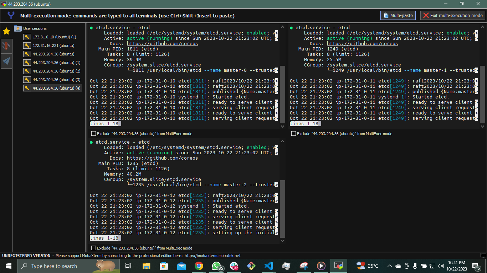

__BOOTSTRAP THE CONTROL PLANE__

Configure the components for the control plane on the master/controller nodes.

Create the Kubernetes configuration directory

`$ sudo mkdir -p /etc/kubernetes/config`


Download the official Kubernetes release binaries:

```
wget -q --show-progress --https-only --timestamping \
"https://storage.googleapis.com/kubernetes-release/release/v1.21.0/bin/linux/amd64/kube-apiserver" \
"https://storage.googleapis.com/kubernetes-release/release/v1.21.0/bin/linux/amd64/kube-controller-manager" \
"https://storage.googleapis.com/kubernetes-release/release/v1.21.0/bin/linux/amd64/kube-scheduler" \
"https://storage.googleapis.com/kubernetes-release/release/v1.21.0/bin/linux/amd64/kubectl"
```

Install the Kubernetes binaries

```
{
chmod +x kube-apiserver kube-controller-manager kube-scheduler kubectl
sudo mv kube-apiserver kube-controller-manager kube-scheduler kubectl /usr/local/bin/
}
```

Configure the Kubernetes API Server

```
{
sudo mkdir -p /var/lib/kubernetes/

sudo mv ca.pem ca-key.pem master-kubernetes-key.pem master-kubernetes.pem \
service-account-key.pem service-account.pem \
encryption-config.yaml /var/lib/kubernetes/
}
```

The instance internal IP address will be used to advertise the API Server to members of the cluster. Retrieve the internal IP address for the current compute instance:

`$ export INTERNAL_IP=$(curl -s http://169.254.169.254/latest/meta-data/local-ipv4)`

Create the __kube-apiserver.service systemd unit file__ Ensure to read each startup flag used in below systemd file from the documentation here

```
cat <<EOF | sudo tee /etc/systemd/system/kube-apiserver.service
[Unit]
Description=Kubernetes API Server
Documentation=https://github.com/kubernetes/kubernetes

[Service]
ExecStart=/usr/local/bin/kube-apiserver \\
  --advertise-address=${INTERNAL_IP} \\
  --allow-privileged=true \\
  --apiserver-count=3 \\
  --audit-log-maxage=30 \\
  --audit-log-maxbackup=3 \\
  --audit-log-maxsize=100 \\
  --audit-log-path=/var/log/audit.log \\
  --authorization-mode=Node,RBAC \\
  --bind-address=0.0.0.0 \\
  --client-ca-file=/var/lib/kubernetes/ca.pem \\
  --enable-admission-plugins=NamespaceLifecycle,NodeRestriction,LimitRanger,ServiceAccount,DefaultStorageClass,ResourceQuota \\
  --etcd-cafile=/var/lib/kubernetes/ca.pem \\
  --etcd-certfile=/var/lib/kubernetes/master-kubernetes.pem \\
  --etcd-keyfile=/var/lib/kubernetes/master-kubernetes-key.pem\\
  --etcd-servers=https://172.31.0.10:2379,https://172.31.0.11:2379,https://172.31.0.12:2379 \\
  --event-ttl=1h \\
  --encryption-provider-config=/var/lib/kubernetes/encryption-config.yaml \\
  --kubelet-certificate-authority=/var/lib/kubernetes/ca.pem \\
  --kubelet-client-certificate=/var/lib/kubernetes/master-kubernetes.pem \\
  --kubelet-client-key=/var/lib/kubernetes/master-kubernetes-key.pem \\
  --runtime-config='api/all=true' \\
  --service-account-key-file=/var/lib/kubernetes/service-account.pem \\
  --service-account-signing-key-file=/var/lib/kubernetes/service-account-key.pem \\
  --service-account-issuer=https://${INTERNAL_IP}:6443 \\
  --service-cluster-ip-range=172.32.0.0/24 \\
  --service-node-port-range=30000-32767 \\
  --tls-cert-file=/var/lib/kubernetes/master-kubernetes.pem \\
  --tls-private-key-file=/var/lib/kubernetes/master-kubernetes-key.pem \\
  --v=2
Restart=on-failure
RestartSec=5

[Install]
WantedBy=multi-user.target
EOF
```

Configure the Kubernetes Controller Manager

Move the kube-controller-manager kubeconfig into place


`$ sudo mv kube-controller-manager.kubeconfig /var/lib/kubernetes/`

Export some variables to retrieve the vpc_cidr – This will be required for the bind-address flag

```
export AWS_METADATA="http://169.254.169.254/latest/meta-data"
export EC2_MAC_ADDRESS=$(curl -s $AWS_METADATA/network/interfaces/macs/ | head -n1 | tr -d '/')
export VPC_CIDR=$(curl -s $AWS_METADATA/network/interfaces/macs/$EC2_MAC_ADDRESS/vpc-ipv4-cidr-block/)
export NAME=manual-k8s-cluster
```

Create the kube-controller-manager.service systemd unit file

```
cat <<EOF | sudo tee /etc/systemd/system/kube-controller-manager.service
[Unit]
Description=Kubernetes Controller Manager
Documentation=https://github.com/kubernetes/kubernetes

[Service]
ExecStart=/usr/local/bin/kube-controller-manager \\
  --bind-address=0.0.0.0 \\
  --cluster-cidr=${VPC_CIDR} \\
  --cluster-name=${NAME} \\
  --cluster-signing-cert-file=/var/lib/kubernetes/ca.pem \\
  --cluster-signing-key-file=/var/lib/kubernetes/ca-key.pem \\
  --kubeconfig=/var/lib/kubernetes/kube-controller-manager.kubeconfig \\
  --authentication-kubeconfig=/var/lib/kubernetes/kube-controller-manager.kubeconfig \\
  --authorization-kubeconfig=/var/lib/kubernetes/kube-controller-manager.kubeconfig \\
  --leader-elect=true \\
  --root-ca-file=/var/lib/kubernetes/ca.pem \\
  --service-account-private-key-file=/var/lib/kubernetes/service-account-key.pem \\
  --service-cluster-ip-range=172.32.0.0/24 \\
  --use-service-account-credentials=true \\
  --v=2
Restart=on-failure
RestartSec=5

[Install]
WantedBy=multi-user.target
EOF
```

Configure the Kubernetes Scheduler

Move the kube-scheduler kubeconfig into place

`$ sudo mv kube-scheduler.kubeconfig /var/lib/kubernetes/`

`$ sudo mkdir -p /etc/kubernetes/config`

Create the kube-scheduler.yaml configuration file

```
cat <<EOF | sudo tee /etc/kubernetes/config/kube-scheduler.yaml
apiVersion: kubescheduler.config.k8s.io/v1beta1
kind: KubeSchedulerConfiguration
clientConnection:
  kubeconfig: "/var/lib/kubernetes/kube-scheduler.kubeconfig"
leaderElection:
  leaderElect: true
EOF
```

Create the kube-scheduler.service systemd unit file

```
cat <<EOF | sudo tee /etc/systemd/system/kube-scheduler.service
[Unit]
Description=Kubernetes Scheduler
Documentation=https://github.com/kubernetes/kubernetes

[Service]
ExecStart=/usr/local/bin/kube-scheduler \\
  --config=/etc/kubernetes/config/kube-scheduler.yaml \\
  --v=2
Restart=on-failure
RestartSec=5

[Install]
WantedBy=multi-user.target
EOF
```

Start the Controller Services

```
{
sudo systemctl daemon-reload
sudo systemctl enable kube-apiserver kube-controller-manager kube-scheduler
sudo systemctl start kube-apiserver kube-controller-manager kube-scheduler
}
```

Check the status of the services. Start with the kube-scheduler and kube-controller-manager. It may take up to 20 seconds for kube-apiserver to be fully loaded.

```
{
sudo systemctl status kube-apiserver
sudo systemctl status kube-controller-manager
sudo systemctl status kube-scheduler
}
```


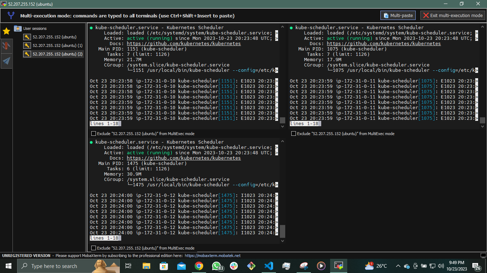
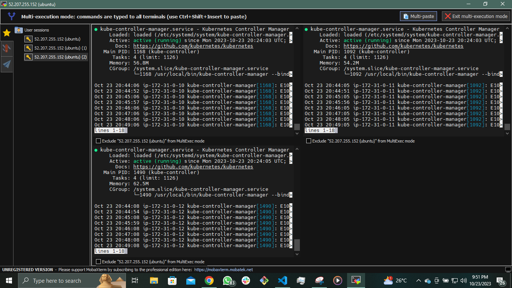

Test that Everything is working fine.

To get the cluster details run

`$ kubectl cluster-info  --kubeconfig admin.kubeconfig`

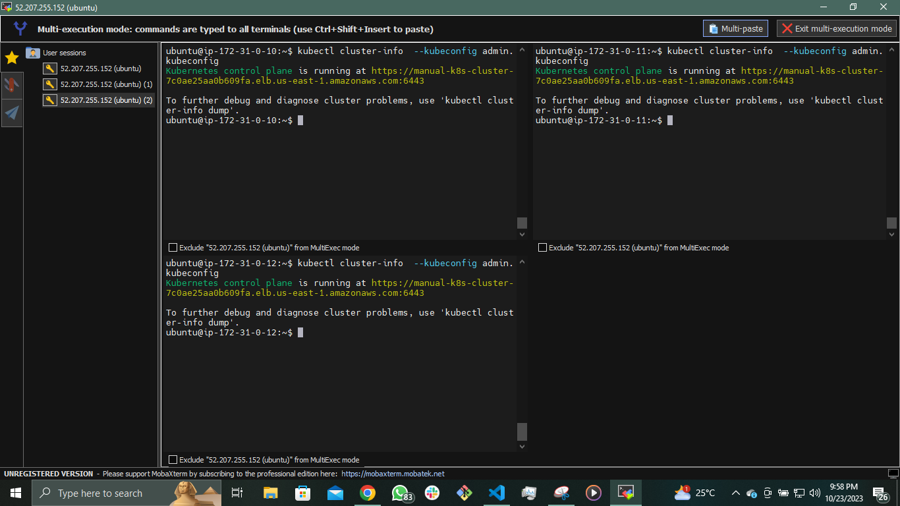

To get the current namespaces

`$ kubectl get namespaces --kubeconfig admin.kubeconfig`

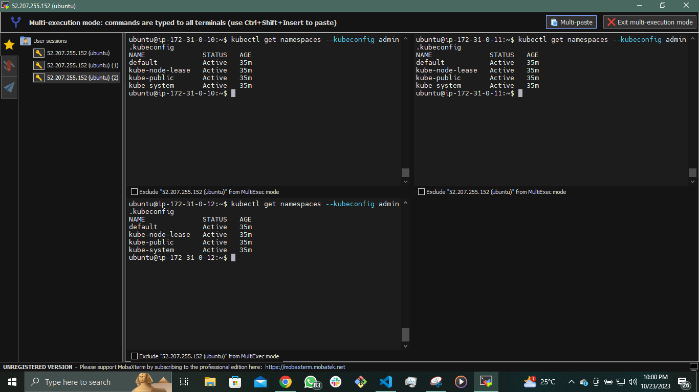

To reach the Kubernetes API Server publicly

`$ kubectl get componentstatuses --kubeconfig admin.kubeconfig`

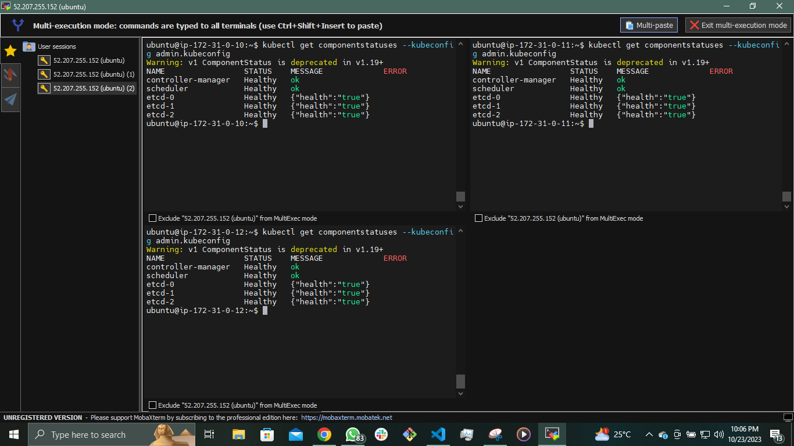

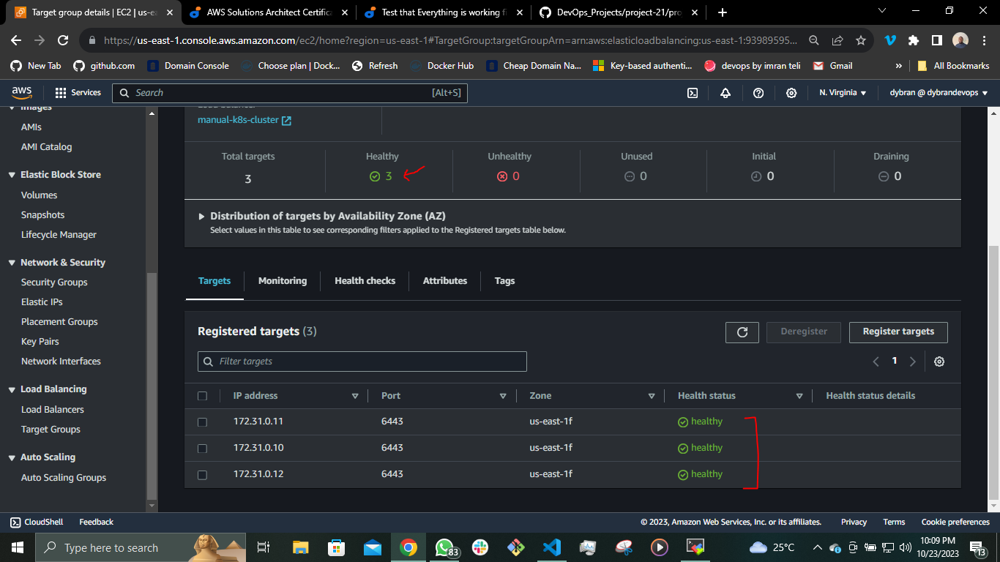

On one of the controller nodes, configure Role Based Access Control (RBAC) so that the api-server has necessary authorization for for the kubelet.

Create the ClusterRole

```
cat <<EOF | kubectl apply --kubeconfig admin.kubeconfig -f -
apiVersion: rbac.authorization.k8s.io/v1
kind: ClusterRole
metadata:
  annotations:
    rbac.authorization.kubernetes.io/autoupdate: "true"
  labels:
    kubernetes.io/bootstrapping: rbac-defaults
  name: system:kube-apiserver-to-kubelet
rules:
  - apiGroups:
      - ""
    resources:
      - nodes/proxy
      - nodes/stats
      - nodes/log
      - nodes/spec
      - nodes/metrics
    verbs:
      - "*"
EOF
```
Create the ClusterRoleBinding to bind the kubernetes user with the role created above

```
cat <<EOF | kubectl --kubeconfig admin.kubeconfig  apply -f -
apiVersion: rbac.authorization.k8s.io/v1
kind: ClusterRoleBinding
metadata:
  name: system:kube-apiserver
  namespace: ""
roleRef:
  apiGroup: rbac.authorization.k8s.io
  kind: ClusterRole
  name: system:kube-apiserver-to-kubelet
subjects:
  - apiGroup: rbac.authorization.k8s.io
    kind: User
    name: kubernetes
EOF
```
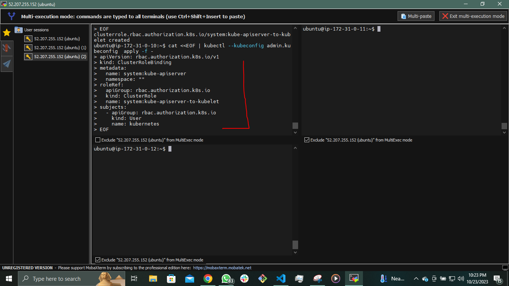


__Configuring the Kubernetes Worker nodes__

The Kubernetes API Server authenticates with the kubelet as the 'kubernetes' user, utilizing the 'kubernetes.pem' certificate for authentication.

To establish Role-Based Access Control (RBAC) for Kubelet Authorization, follow these steps:

- Set up RBAC permissions to grant the Kubernetes API Server access to the Kubelet API on every worker node. This access is essential for tasks such as retrieving metrics, logs, and executing commands within pods.

- Create the 'system:kube-apiserver-to-kubelet' ClusterRole, which includes permissions for accessing the Kubelet API and executing common operations related to pod management on the worker nodes.

To initiate this configuration, execute the provided script on the Controller node.

```
cat <<EOF | kubectl apply --kubeconfig admin.kubeconfig -f -
apiVersion: rbac.authorization.k8s.io/v1
kind: ClusterRole
metadata:
  annotations:
    rbac.authorization.kubernetes.io/autoupdate: "true"
  labels:
    kubernetes.io/bootstrapping: rbac-defaults
  name: system:kube-apiserver-to-kubelet
rules:
  - apiGroups:
      - ""
    resources:
      - nodes/proxy
      - nodes/stats
      - nodes/log
      - nodes/spec
      - nodes/metrics
    verbs:
      - "*"
EOF
```
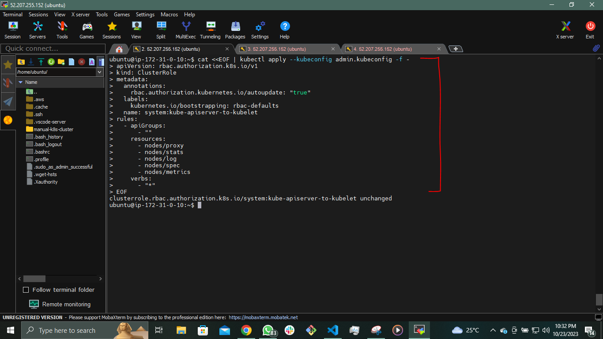

Bind the __system:kube-apiserver-to-kubelet__ ClusterRole to the kubernetes user so that API server can authenticate successfully to the kubelets on the worker nodes

```
cat <<EOF | kubectl apply --kubeconfig admin.kubeconfig -f -
apiVersion: rbac.authorization.k8s.io/v1
kind: ClusterRoleBinding
metadata:
  name: system:kube-apiserver
  namespace: ""
roleRef:
  apiGroup: rbac.authorization.k8s.io
  kind: ClusterRole
  name: system:kube-apiserver-to-kubelet
subjects:
  - apiGroup: rbac.authorization.k8s.io
    kind: User
    name: kubernetes
EOF
```


Bootstraping components on the worker nodes

The following components will be installed on each node

- kubelet
- kube-proxy
- Containerd or Docker
- Networking plugins

SSH into the worker nodes

Worker-1

```
$ worker_1_ip=$(aws ec2 describe-instances \
--filters "Name=tag:Name,Values=manual-k8s-cluster-worker-0" \
--output text --query 'Reservations[].Instances[].PublicIpAddress')
ssh -i ssh/manual-k8s-cluster.id_rsa ubuntu@${worker_1_ip}
```

Worker-2

```
$ worker_2_ip=$(aws ec2 describe-instances \
--filters "Name=tag:Name,Values=manual-k8s-cluster-worker-1" \
--output text --query 'Reservations[].Instances[].PublicIpAddress')
ssh -i ssh/manual-k8s-cluster.id_rsa ubuntu@${worker_2_ip}
```
Worker-3

```
$ worker_3_ip=$(aws ec2 describe-instances \
--filters "Name=tag:Name,Values=manual-k8s-cluster-worker-2" \
--output text --query 'Reservations[].Instances[].PublicIpAddress')
ssh -i ssh/manual-k8s-cluster.id_rsa ubuntu@${worker_3_ip}
```

Install OS dependencies

```
{
  sudo apt-get update
  sudo apt-get -y install socat conntrack ipset
}
```


More about the dependencies:

- __Socat__ is the default implementation for Kubernetes port-forwarding when using dockershim for the kubelet runtime.

- __Dockershim__ was a temporary solution proposed by the Kubernetes community to add support for Docker so that it could serve as its container runtime. You should always remember that Kubernetes can use different container runtime to run containers inside its pods. For many years, Docker has been adopted widely and has been used as the container runtime for kubernetes. Hence the implementation that allowed docker is called the Dockershim. If you check the source code of Dockershim, you will see that socat was used to implement the port-forwarding functionality.

- __conntrack__ Connection tracking (“conntrack”) is a core feature of the Linux kernel’s networking stack. It allows the kernel to keep track of all logical network connections or flows, and thereby identify all of the packets which make up each flow so they can be handled consistently together. It is essential for performant complex networking of Kubernetes where nodes need to track connection information between thousands of pods and services.

- __ipset__ is an extension to iptables which is used to configure firewall rules on a Linux server. ipset is a module extension to iptables that allows firewall configuration on a "set" of IP addresses. Compared with how iptables does the configuration linearly, ipset is able to store sets of addresses and index the data structure, making lookups very efficient, even when dealing with large sets. Kubernetes uses ipsets to implement a distributed firewall solution that enforces network policies within the cluster. This can then help to further restrict communications across pods or namespaces. For example, if a namespace is configured with __DefaultDeny__ isolation type (Meaning no connection is allowed to the namespace from another namespace), network policies can be configured in the namespace to whitelist the traffic to the pods in that namespace.

__Kubernetes Network Policy And How It Is Implemented__

__Kubernetes network policies__ are application centric compared to infrastructure/network centric standard firewalls. There are no explicit CIDR or IP used for matching source or destination IP’s. Network policies build up on labels and selectors which are key concepts of Kubernetes that are used for proper organization (for e.g dedicating a namespace to data layer and controlling which app is able to connect there). A typical network policy that controls who can connect to the database namespace will look like below

```
apiVersion: extensions/v1beta1
kind: NetworkPolicy
metadata:
  name: database-network-policy
  namespace: tooling-db
spec:
  podSelector:
    matchLabels:
      app: mysql
  ingress:
   - from:
     - namespaceSelector:
       matchLabels:
         app: tooling
     - podSelector:
       matchLabels:
       role: frontend
   ports:
     - protocol: tcp
     port: 3306
```

__NOTE:__ Best practice is to use solutions like RDS for database implementation.

Disable Swap

If swap is not disabled, kubelet will not start. It is highly recommended to allow Kubernetes to handle resource allocation.

Test if swap is already enabled on the host

`$ sudo swapon --show`

If there is no output, then you are good to go. Otherwise, run below command to turn it off

`$ sudo swapoff -a`

Download and install a container runtime. (Docker Or Containerd)

Containerd

Download binaries for runc, cri-ctl, and containerd

```
 wget https://github.com/opencontainers/runc/releases/download/v1.0.0-rc93/runc.amd64 \
  https://github.com/kubernetes-sigs/cri-tools/releases/download/v1.21.0/crictl-v1.21.0-linux-amd64.tar.gz \
  https://github.com/containerd/containerd/releases/download/v1.4.4/containerd-1.4.4-linux-amd64.tar.gz 
```
Configure containerd

```
{
  mkdir containerd
  tar -xvf crictl-v1.21.0-linux-amd64.tar.gz
  tar -xvf containerd-1.4.4-linux-amd64.tar.gz -C containerd
  sudo mv runc.amd64 runc
  chmod +x  crictl runc  
  sudo mv crictl runc /usr/local/bin/
  sudo mv containerd/bin/* /bin/
}
```

`$ sudo mkdir -p /etc/containerd/`

```
cat << EOF | sudo tee /etc/containerd/config.toml
[plugins]
  [plugins.cri.containerd]
    snapshotter = "overlayfs"
    [plugins.cri.containerd.default_runtime]
      runtime_type = "io.containerd.runtime.v1.linux"
      runtime_engine = "/usr/local/bin/runc"
      runtime_root = ""
EOF
```

Create the containerd.service systemd unit file

```
cat <<EOF | sudo tee /etc/systemd/system/containerd.service
[Unit]
Description=containerd container runtime
Documentation=https://containerd.io
After=network.target

[Service]
ExecStartPre=/sbin/modprobe overlay
ExecStart=/bin/containerd
Restart=always
RestartSec=5
Delegate=yes
KillMode=process
OOMScoreAdjust=-999
LimitNOFILE=1048576
LimitNPROC=infinity
LimitCORE=infinity

[Install]
WantedBy=multi-user.target
EOF
```

Create directories for to configure kubelet, kube-proxy, cni, and a directory to keep the kubernetes root ca file

```
sudo mkdir -p \
  /var/lib/kubelet \
  /var/lib/kube-proxy \
  /etc/cni/net.d \
  /opt/cni/bin \
  /var/lib/kubernetes \
  /var/run/kubernetes
```

__Download and Install Container Network Interface (CNI)__

Container Network Interface (CNI), a Cloud Native Computing Foundation project, consists of a specification and libraries for writing plugins to configure network interfaces in Linux containers. It also comes with a number of plugins.

Kubernetes uses CNI as an interface between network providers and Kubernetes Pod networking. Network providers create network plugin that can be used to implement the Kubernetes networking, and includes additional set of rich features that Kubernetes does not provide out of the box.

Download the plugins available from [containernetworking’s](https://github.com/containernetworking/cni) GitHub repo and read more about CNIs and why it is being developed.

```
wget -q --show-progress --https-only --timestamping \
  https://github.com/containernetworking/plugins/releases/download/v0.9.1/cni-plugins-linux-amd64-v0.9.1.tgz
```

Install CNI into /opt/cni/bin/

`$ sudo tar -xvf cni-plugins-linux-amd64-v0.9.1.tgz -C /opt/cni/bin/`

There are few other plugins that are not included in the CNI, which are also widely used in the industry. They all have their unique implementation approach and set of features.

Click to read more about each of the network plugins below:

- Calico
- Weave Net
- flannel

Sometimes you can combine more than one plugin together to maximize the use of features from different providers. Or simply use a CNI network provider such as canal that gives you the best of Flannel and Calico.

Download binaries for kubectl, kube-proxy, and kubelet

```
wget -q --show-progress --https-only --timestamping \
  https://storage.googleapis.com/kubernetes-release/release/v1.21.0/bin/linux/amd64/kubectl \
  https://storage.googleapis.com/kubernetes-release/release/v1.21.0/bin/linux/amd64/kube-proxy \
  https://storage.googleapis.com/kubernetes-release/release/v1.21.0/bin/linux/amd64/kubelet
```

Install the downloaded binaries

```
{
  chmod +x  kubectl kube-proxy kubelet  
  sudo mv  kubectl kube-proxy kubelet /usr/local/bin/
}
```

__Configure the worker nodes components__

__Configure kubelet__

In the home directory, you should have the certificates and kubeconfig file for each node. A list in the home folder should look like below:


__Configuring the network__

Get the __POD_CIDR__ that will be used as part of network configuration

```
POD_CIDR=$(curl -s http://169.254.169.254/latest/user-data/ \
  | tr "|" "\n" | grep "^pod-cidr" | cut -d"=" -f2)
echo "${POD_CIDR}"
```


In case you are wondering where this POD_CIDR is coming from. Well, this was configured at the time of creating the worker nodes. Remember the for loop below? The --user-data flag is where we specified what we want the POD_CIDR to be. It is very important to ensure that the CIDR does not overlap with EC2 IPs within the subnet. In the real world, this will be decided in collaboration with the Network team.

Why do we need a network plugin? And why network configuration is crucial to implementing a Kubernetes cluster?

First, let us understand the Kubernetes networking model:

The networking model assumes a flat network, in which containers and nodes can communicate with each other. That means, regardless of which node is running the container in the cluster, Kubernetes expects that all the containers must be able to communicate with each other. Therefore, any network interface used for a Kubernetes implementation must follow this requirement. Otherwise, containers running in pods will not be able to communicate. Of course, this has security concerns. Because if an attacker is able to get into the cluster through a compromised container, then the entire cluster can be exploited.

To mitigate security risks and have a better controlled network topology, Kubernetes uses CNI (Container Network Interface) to manage Network Policies which can be used to operate the Pod network through external plugins such as Calico, Flannel or Weave Net to name a few. With these, you can set policies similar to how you would configure segurity groups in AWS and limit network communications through either cidr ipBlock, namespaceSelectors, or podSelectors, you will see more of these concepts further on.

To really understand Kubernetes further, let us explore some basic concepts around its networking:

Pods:

A Pod is the basic building block of Kubernetes; it is the smallest and simplest unit in the Kubernetes object model that you create or deploy. A Pod represents a running process on your cluster.
It encapsulates a container running an application such as the Tooling website (or, in some cases, multiple containers), storage resources, a unique network IP, and options that govern how the container(s) should run. All the containers running inside a Pod can reach each other on localhost.

For example, if you deploy both Tooling and MySQL containers inside the same pod, then both of them are considered running on localhost. Although this design pattern is not ideal. Most likely they will run in separate Pods. In most cases one Pod contains just one container, but there are some design patterns that imply multi-container pods (e.g. sidecar, ambassador, adapter) – you can read more about them in this article.


For more detailed explanation of different aspects of Kubernetes networking – [Click here](https://www.youtube.com/watch?v=5cNrTU6o3Fw).

__Pod Network__

You must decide on the Pod CIDR per worker node. Each worker node will run multiple pods, and each pod will have its own IP address. IP address of a particular Pod on worker node 1 should be able to communicate with the IP address of another particular Pod on worker node 2. For this to become possible, there must be a bridge network with virtual network interfaces that connects them all together. Here is an interesting read that goes a little deeper into how it works Bookmark that page and read it over and over again after you have completed this project

Configure the bridge and loopback networks
Bridge

```
cat > 172-20-bridge.conf <<EOF
{
    "cniVersion": "0.3.1",
    "name": "bridge",
    "type": "bridge",
    "bridge": "cnio0",
    "isGateway": true,
    "ipMasq": true,
    "ipam": {
        "type": "host-local",
        "ranges": [
          [{"subnet": "${POD_CIDR}"}]
        ],
        "routes": [{"dst": "0.0.0.0/0"}]
    }
}
EOF
```

Loopback

```
cat > 99-loopback.conf <<EOF
{
    "cniVersion": "0.3.1",
    "type": "loopback"
}
EOF
```
Move the files to the network configuration directory

`$ sudo mv 172-20-bridge.conf 99-loopback.conf /etc/cni/net.d/`

Store the worker’s name in a variable

```
NAME=manual-k8s-cluster
WORKER_NAME=${NAME}-$(curl -s http://169.254.169.254/latest/user-data/ \
  | tr "|" "\n" | grep "^name" | cut -d"=" -f2)
echo "${WORKER_NAME}"
```
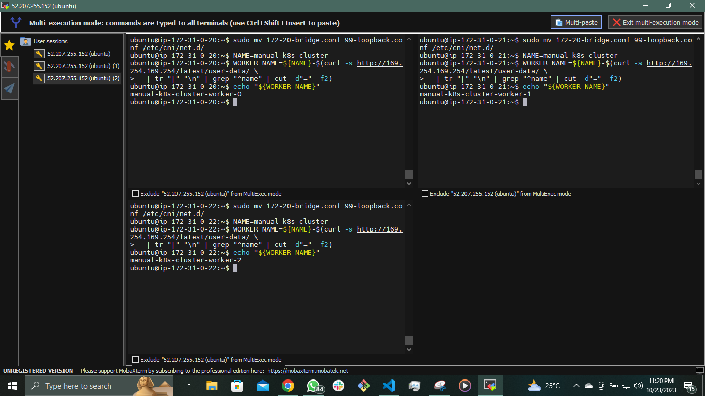

Move the certificates and kubeconfig file to their respective configuration directories


`$ sudo mv ${WORKER_NAME}-key.pem ${WORKER_NAME}.pem /var/lib/kubelet/`

`$ sudo mv ${WORKER_NAME}.kubeconfig /var/lib/kubelet/kubeconfig`

`$ sudo mv kube-proxy.kubeconfig /var/lib/kube-proxy/kubeconfig`

`$ sudo mv ca.pem /var/lib/kubernetes/`

Create the kubelet-config.yaml file

Ensure the needed variables exist

```
NAME=manual-k8s-cluster
WORKER_NAME=${NAME}-$(curl -s http://169.254.169.254/latest/user-data/ \
  | tr "|" "\n" | grep "^name" | cut -d"=" -f2)
echo "${WORKER_NAME}"
```
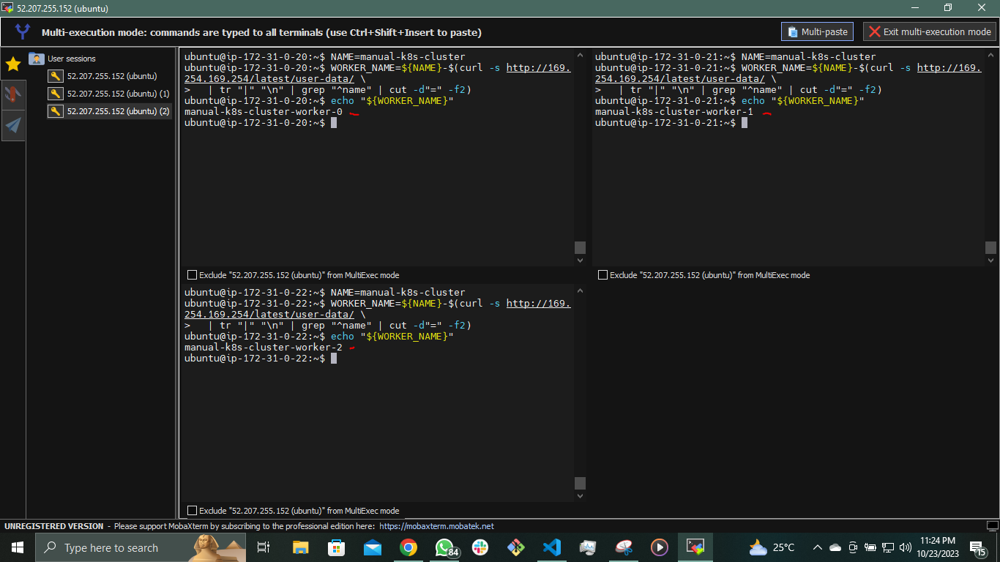

```
cat <<EOF | sudo tee /var/lib/kubelet/kubelet-config.yaml
kind: KubeletConfiguration
apiVersion: kubelet.config.k8s.io/v1beta1
authentication:
  anonymous:
    enabled: false
  webhook:
    enabled: true
  x509:
    clientCAFile: "/var/lib/kubernetes/ca.pem"
authorization:
  mode: Webhook
clusterDomain: "cluster.local"
clusterDNS:
  - "10.32.0.10"
resolvConf: "/etc/resolv.conf"
runtimeRequestTimeout: "15m"
tlsCertFile: "/var/lib/kubelet/${WORKER_NAME}.pem"
tlsPrivateKeyFile: "/var/lib/kubelet/${WORKER_NAME}-key.pem"
EOF
```

__FINAL STEPS__

Let us talk about the configuration file kubelet-config.yaml and the actual configuration for a bit. Before creating the systemd file for kubelet, it is recommended to create the kubelet-config.yaml and set the configuration there rather than using multiple startup flags in systemd. You will simply point to the yaml file.

The config file specifies where to find certificates, the DNS server, and authentication information. As you already know, kubelet is responsible for the containers running on the node, regardless if the runtime is Docker or Containerd; as long as the containers are being created through Kubernetes, kubelet manages them. If you run any docker or cri commands directly on a worker to create a container, bear in mind that Kubernetes is not aware of it, therefore kubelet will not manage those. Kubelet’s major responsibility is to always watch the containers in its care, by default every 20 seconds, and ensuring that they are always running. Think of it as a process watcher.

The clusterDNS is the address of the DNS server. As of Kubernetes v1.12, CoreDNS is the recommended DNS Server, hence we will go with that, rather than using legacy kube-dns.

Note: The CoreDNS Service is named kube-dns(When you see kube-dns, just know that it is using CoreDNS). This is more of a backward compatibility reasons for workloads that relied on the legacy kube-dns Service name.

In Kubernetes, Pods are able to find each other using service names through the internal DNS server. Every time a service is created, it gets registered in the DNS server.

In Linux, the /etc/resolv.conf file is where the DNS server is configured. If you want to use Google’s public DNS server (8.8.8.8) your /etc/resolv.conf file will have following entry:

nameserver 8.8.8.8

In Kubernetes, the kubelet process on a worker node configures each pod. Part of the configuration process is to create the file /etc/resolv.conf and specify the correct DNS server.

Configure the kubelet systemd service

```
cat <<EOF | sudo tee /etc/systemd/system/kubelet.service
[Unit]
Description=Kubernetes Kubelet
Documentation=https://github.com/kubernetes/kubernetes
After=containerd.service
Requires=containerd.service
[Service]
ExecStart=/usr/local/bin/kubelet \\
  --config=/var/lib/kubelet/kubelet-config.yaml \\
  --cluster-domain=cluster.local \\
  --container-runtime=remote \\
  --container-runtime-endpoint=unix:///var/run/containerd/containerd.sock \\
  --image-pull-progress-deadline=2m \\
  --kubeconfig=/var/lib/kubelet/kubeconfig \\
  --network-plugin=cni \\
  --register-node=true \\
  --v=2
Restart=on-failure
RestartSec=5
[Install]
WantedBy=multi-user.target
EOF
```

Create the kube-proxy.yaml file

```
cat <<EOF | sudo tee /var/lib/kube-proxy/kube-proxy-config.yaml
kind: KubeProxyConfiguration
apiVersion: kubeproxy.config.k8s.io/v1alpha1
clientConnection:
  kubeconfig: "/var/lib/kube-proxy/kubeconfig"
mode: "iptables"
clusterCIDR: "172.31.0.0/16"
EOF
```

Configure the Kube Proxy systemd service

```
cat <<EOF | sudo tee /etc/systemd/system/kube-proxy.service
[Unit]
Description=Kubernetes Kube Proxy
Documentation=https://github.com/kubernetes/kubernetes
[Service]
ExecStart=/usr/local/bin/kube-proxy \\
  --config=/var/lib/kube-proxy/kube-proxy-config.yaml
Restart=on-failure
RestartSec=5
[Install]
WantedBy=multi-user.target
EOF
```

Reload configurations and start both services

```
{
  sudo systemctl daemon-reload
  sudo systemctl enable containerd kubelet kube-proxy
  sudo systemctl start containerd kubelet kube-proxy
}
```

Check status of the service

`$ sudo systemctl status containerd`

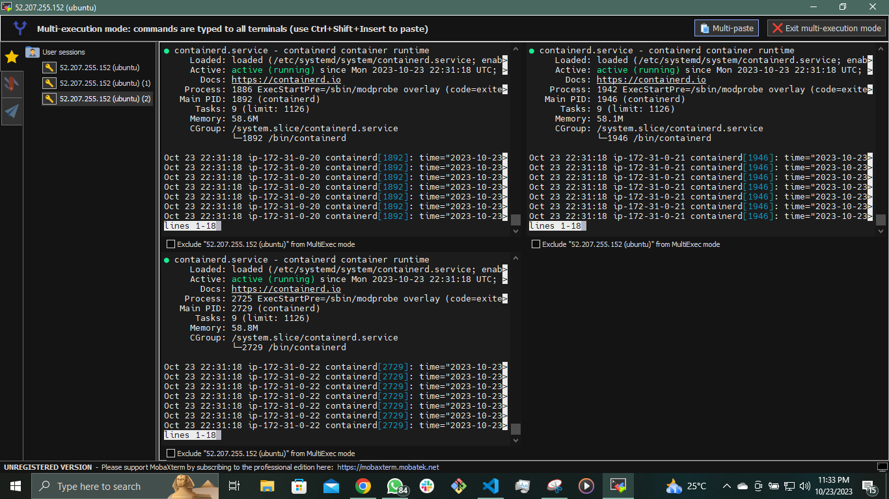


