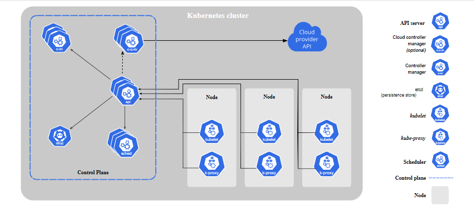
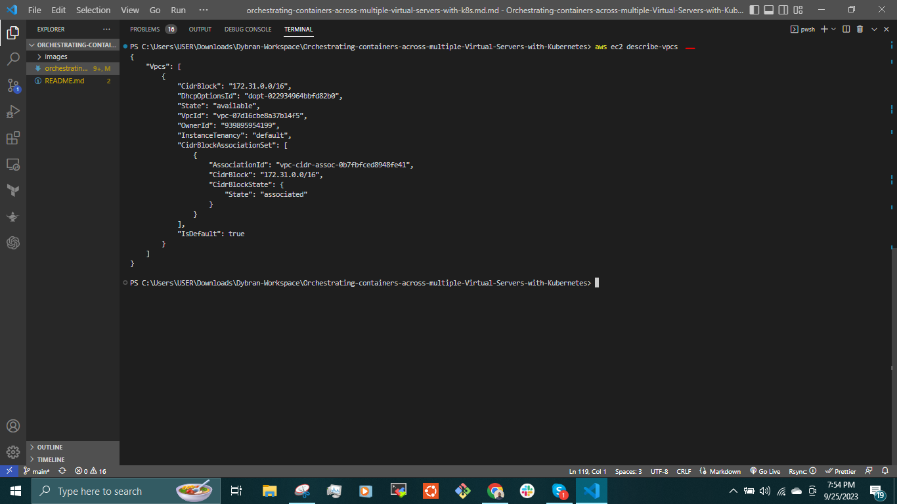

## ORCHESTRATING CONTAINERS ACROSS MULTIPLE VIRTUAL SERVERS WITH KUBERNETES- Part 1

In this project, I will delve into industry tools designed for seamless production deployment.

Containers represent the epitome of lightweight and easily transportable workloads. They boast quicker startup times than virtual machines (VMs), consume minimal storage and memory resources, and are an ideal fit for accommodating microservices architecture. Consequently, the number of containers typically far exceeds the number of VMs, bringing with it the intricacies of container management.

To effectively oversee a fleet of containers, various software solutions are available, with Kubernetes (often referred to as K8s) standing out as the most widely adopted option. Originally developed by Google, Kubernetes is now maintained by the Cloud Native Computing Foundation (CNCF).

Docker Compose can be used to deploy Docker containers. It is a valuable tool that simplifies the deployment process by creating a declarative configuration file, thus eliminating the need for multiple command-line instructions. Docker Compose proves particularly useful when deploying a limited number of containers. However, when it comes to production deployments it presents certain limitations.

It is crucial to recognize that in the realm of DevOps, the emphasis lies on __"Culture"__ rather than __"Tools"__. Consequently, it is inappropriate to label one tool as superior to another since different organizations have varying requirements. What works well for one team may not suit another, owing to divergent needs. In some cases, Docker Compose aligns perfectly with the specific demands, despite the apparent constraints.

One of Docker Compose's major drawbacks is its confinement to running workloads on a single computer host. This limitation becomes evident when considering scenarios where both the Tooling Application and its Database are hosted on a single virtual machine. In such instances, this single host becomes a __Potential Single Point Of Failure (SPOF)__, making it a less-than-ideal choice for robust production environments.

So, can we conclude that Docker Compose is inherently flawed? Not necessarily. In fact, it is widely employed in the industry, effectively fulfilling specific use cases that demand rapid development and proof of concepts. As we delve into Kubernetes, you'll soon realize that it is a significantly more intricate technology, potentially over-engineered for scenarios that require a simpler approach.

__Container Orchestration with Kubernetes__

Container orchestration is a process for automating the deployment, scaling, management, and networking of containers.
Here are two key considerations to keep in mind regarding Docker containers:

1. __Ephemeral Nature__:
   Unlike virtual machines, Docker containers are not intended for long-term operation. They are designed to be ephemeral, meaning they can be easily stopped and destroyed. However, you can recreate a new container from the same Docker image with minimal setup and configuration requirements.

2. __Scalability Across Compute Nodes__:
   To achieve high scalability, Docker containers must be configured to run across multiple compute nodes, which can be either physical servers or virtual machines with the Docker engine installed to manage containers.

Now, let's address a specific scenario based on these considerations:

Consider a situation where you have two compute nodes to run your containers. For instance, Node 1 is hosting a container for a Website, while Node 2 is running a database container. In this setup, two important challenges arise:

1. __Resilience Across Nodes__:
   If a container on Node 1 were to fail or become unavailable, it is essential to ensure that it can be automatically restarted on Node 2. Achieving this kind of resilience typically requires additional orchestration tools like Kubernetes, Docker Swarm or other container orchestration solutions. These tools can monitor the health of containers and automatically redistribute workloads across available nodes to maintain service availability.

2. __Inter-Node Communication__:
   Unlike when containers run on the same host, containers on separate hosts do not have native network communication. To enable communication between the Tooling website container on Node 1 and thedatabase container on Node 2, you need to set up networking solutions specifically designed for cross-node communication. This typically involves creating a custom network overlay that spans both hosts. Orchestration tools mentioned earlier often provide networking features to facilitate this communication.

In summary, while Docker containers offer flexibility and ease of deployment, managing containers across multiple compute nodes introduces challenges related to resilience and inter-node communication. To address these challenges, container orchestration tools and network overlays are commonly employed to ensure the reliable and coordinated operation of containers in distributed environments.

Container orchestration is a concept that allows to address these two scenarios, it provides automation of all the aspects of coordinating and managing containers. Container orchestration is focused on managing life cycle of containers and their dynamic environments.

At its core, container orchestration entails the automation of the complete container lifecycle, orchestrating their deployment across multiple nodes, encompassing tasks such as:

- Configuring and efficiently scheduling containers on nodes.
- Ensuring container availability, even in the face of failures.
- Dynamically scaling containers to evenly distribute application workloads across the infrastructure.
- Resource allocation management among containers.
- Implementing load balancing, traffic routing, and enabling service discovery for containers.
- Continuous health monitoring of containers.
- Ensuring robust security measures for container interactions.

Kubernetes emerges as a formidable tool designed explicitly for container orchestration, excelling when configured correctly.

Read about every component in the [official documentation](https://kubernetes.io/docs/concepts/overview/components/).

__Kubernetes architecture__

__Kubernetes From-Ground-Up__

For a better understanding of each aspect of spinning up a Kubernetes cluster, I will install each and every component manually from scratch.

To successfully implement "K8s From-Ground-Up", the following and even more will be done as a K8s administrator:

- Install and configure master (also known as control plane) node components and worker nodes.
- Apply security settings across the entire cluster (i.e., encrypting the data in transit, and at rest)
    - In transit encryption means encrypting communications over the network using HTTPS
    - At rest encryption means encrypting the data stored on a disk
- Plan the capacity for the backend data store etcd
- Configure network plugins for the containers to communicate
- Manage periodical upgrade of the cluster
- Configure observability and auditing

Tools to be used and expected result.
- VM: AWS EC2
- OS: Ubuntu 20.04 lts+
- Docker Engine
- kubectl console utility
- cfssl and cfssljson utilities
- Kubernetes cluster
- 
I will create 3 EC2 Instances, and in the end, I will have the following parts of the cluster properly configured:

- One Master node/Control plane.
- Two Worker Nodes
- Configured SSL/TLS certificates for Kubernetes components to communicate securely
- Configured Node Network
- Configured Pod Network

__SETTING UP THE KUBERNETES CLUSTER (MANUALLY)__

__INSTALL CLIENT TOOLS__

Spin up an EC2 Insstance and install some tools on the client workstation:

__awscli__ – is a unified tool to manage your AWS services.

__kubectl__ – this command line utility will be the main control tool to manage the K8s cluster.

__cfssl__ – an open source toolkit for everything TLS/SSL from Cloudflare

__cfssljson__ – a program, which takes the JSON output from the cfssl and writes certificates, keys, CSRs, and bundles to disk.

__Install and configure AWS CLI__

I need to create a user in my AWS console with programmatic access keys configured in AWS Identity and Access Management (IAM) then Configure AWS CLI to access all AWS services used.

Generate access keys and store them in a safe place.

On my local workstation download and install the latest version of AWS CLI.

To configure the AWS CLI run:

`$ aws configure` and follow the prompt.

To verify run any __aws cli__ commands.

`$ aws ec2 describe-vpcs`

and check if you can see VPC details.

__Install kubectl__

A Kubernetes cluster features a Web API capable of handling __HTTP/HTTPS__ requests. However, continually using curl to send commands can be cumbersome. To streamline the tasks of a Kubernetes administrator, the __kubectl__ command tool was created.

This versatile tool simplifies interactions with Kubernetes, enabling administrators to effortlessly deploy applications, inspect and manage cluster resources, access logs and execute various administrative tasks.

Download the binary

`$ wget https://storage.googleapis.com/kubernetes-release/release/v1.21.0/bin/linux/amd64/kubectl`